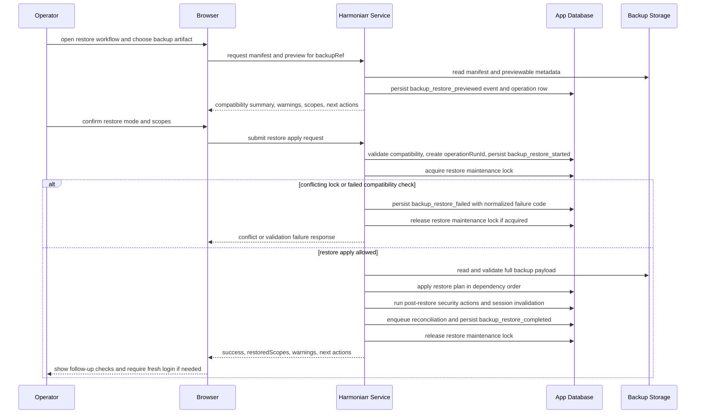
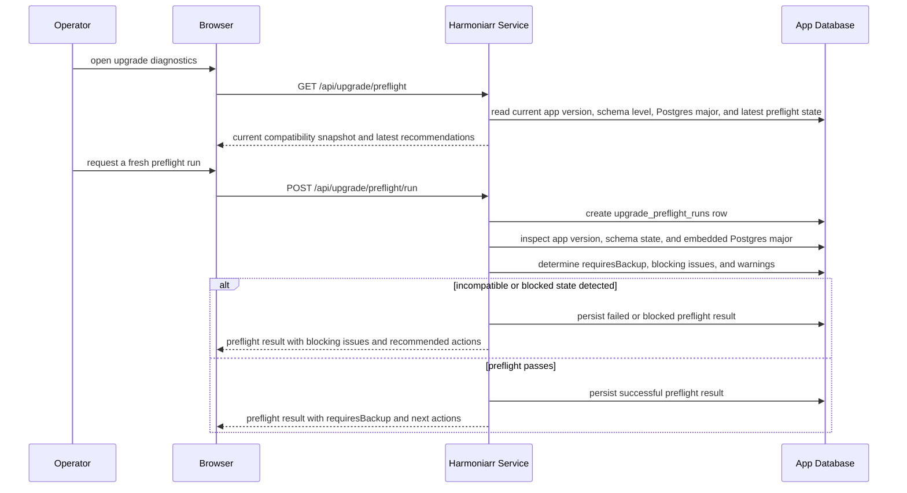

# Harmoniarr Backup, Restore, And Upgrade Design

## Purpose

This document turns the backup, restore, and upgrade planning in `docs/harmoniarr.md` into an implementation-oriented design.

It focuses on:

- service boundaries
- backup artifact and manifest design
- restore planning and orchestration
- maintenance locking
- suggested tables and records
- API and function shape

This is not the security policy document. Security requirements still live in `docs/SECURITY_POLICY.md`.

## Design Goals

The recovery design should optimize for the actual Harmoniarr platform shape.

Primary goals:

- Back up logical application state, not raw media files.
- Make restore safe, previewable, and fail-closed.
- Keep upgrade safety explicit.
- Support embedded Postgres and Docker-first deployment.
- Preserve enough metadata to explain what a backup contains and what a restore changed.

Non-goals for v1:

- Full media-library backup.
- Full host disaster-recovery orchestration.
- Automatic PostgreSQL major upgrades.
- Restoring active sessions or transient worker state.

## Recovery Layers

Harmoniarr should treat recovery as two separate layers.

### Layer 1: Logical App Backup

This is the app-managed backup feature.

It should capture durable application state such as:

- runtime settings
- slskd connection settings
- provider settings
- path mappings
- media management settings
- quality profiles
- monitoring rules
- wanted state
- source-user trust and operator notes
- manual overrides and correlations

It should not capture:

- local user credentials or password hashes
- local user rows used for interactive login
- active sessions
- refresh tokens
- active jobs or transfers
- temporary caches
- artwork derivatives and temporary artwork workspace
- staged downloads
- final media files
- embedded Postgres physical cluster files

Artwork backup stance:

- logical backups should exclude artwork binaries by default, including provider-fetched originals, extracted image copies, and generated derivatives
- artwork descriptor and assignment rows may remain in logical backup scope when they are needed to explain presentation preference or future refetch intent
- restore should tolerate missing artwork files by marking those assets stale or missing and scheduling refetch or derivative regeneration instead of failing the full restore
- operator-managed volume backups of `/app/data` remain the correct mechanism when the operator wants to preserve the local artwork cache itself

### v1 Authentication Recovery Decision

Harmoniarr should not treat logical backup restore as the primary recovery path for local authentication state.

For v1:

- logical backups should exclude local user rows, password hashes, refresh-token state, session state, CSRF state, and API keys
- restore should never reactivate prior browser sessions or integration credentials as live state
- admin recovery should use a separate operator-controlled bootstrap path rather than normal backup restore

Recommended recovery shape:

- if the operator has local container or volume control, Harmoniarr may expose a dedicated bootstrap-admin recovery flow
- that flow should create or re-enable one recoverable admin path without claiming to restore prior interactive auth state
- after restore, the operator should authenticate through a fresh admin session and reissue any integration credentials that were rotated

This matches Harmoniarr's threat model better than restoring local auth records as ordinary configuration.

Operator-oriented step-by-step recovery guidance lives in `docs/ADMIN_RECOVERY_RUNBOOK.md`.

### Bootstrap-Admin Recovery Mechanics

The bootstrap-admin recovery flow should be treated as an emergency path, not a convenience feature.

#### Entry Conditions

- use normal first-run setup when no users exist
- use bootstrap-admin recovery only when users exist but the operator has lost usable admin access
- require direct local control of the container or mounted app volume before recovery can be armed
- do not provide a normal remote HTTP route that can arm recovery by itself

#### Arming Model

Decided v1 arming surface:

- arm recovery through a packaged local operator CLI shipped inside the image and any first-party packaged runtime
- canonical command shape: `harmoniarrctl recovery arm-bootstrap-admin`
- companion commands: `harmoniarrctl recovery cancel-bootstrap-admin` and `harmoniarrctl recovery bootstrap-admin-status`
- the arm command should create one short-lived recovery run, store only a hash of the one-time recovery code, and print the plaintext code once to the local operator

Example Docker-first usage:

```text
docker exec harmoniarr harmoniarrctl recovery arm-bootstrap-admin
docker exec harmoniarr harmoniarrctl recovery bootstrap-admin-status
docker exec harmoniarr harmoniarrctl recovery cancel-bootstrap-admin
```

Required arming properties:

- one-time code only
- short expiration window, recommended 15 minutes
- single active recovery run at a time
- explicit cancel or automatic expiry
- audit event for arm, cancel, expire, and complete
- fail closed if the app database is unavailable; this path should not bypass database-backed audit and lock checks

The v1 build should prefer this CLI over file-watch triggers, sentinel files, or environment-variable toggles. Those alternatives are harder to audit, easier to misapply in automation, and less explicit for operators.

If a desktop package or non-container distribution needs a different wrapper, it should still route through the same local `harmoniarrctl` recovery implementation and persistence rules. The core rule is that remote HTTP alone must not be sufficient to arm recovery.

#### Completion Model

Once armed, the app may expose a limited public recovery completion flow.

The completion flow should:

- require the one-time recovery code
- require a new admin username when a new user must be created
- require a password that meets the normal password policy
- be heavily rate-limited
- fail closed after code expiry or repeated invalid attempts

On success, the completion flow should:

- acquire an `admin_recovery` maintenance lock
- revoke all interactive browser sessions and refresh-token-backed sessions
- create one new admin path or re-enable one designated recovery-safe admin path
- clear the armed recovery run so the code cannot be reused
- emit structured audit events for the full lifecycle

The completion flow should not automatically log the operator in. It should force a fresh normal login with the newly created or recovered admin credentials.

#### Post-Recovery Actions

After successful bootstrap-admin recovery, the UI should force the operator through a short recovery checklist.

Minimum checklist items:

- confirm fresh login succeeded
- review existing admin accounts
- revoke or rotate Harmoniarr-issued API keys if compromise is suspected
- verify backup, restore, and provider settings remain correct
- clear any remaining maintenance or recovery banners

#### Failure Rules

- if a restore maintenance lock is active, bootstrap-admin completion should refuse to run
- if an upgrade maintenance lock is active, bootstrap-admin completion should refuse to run
- if the one-time code expires, the operator must arm a new recovery run locally
- if repeated failures cross the configured threshold, the active recovery run should be invalidated and require local re-arming

### CLI Contract And Operator UX

The local recovery CLI should be explicit, scriptable, and safe to run in automation without leaking secrets unexpectedly.

#### Commands

```text
harmoniarrctl recovery arm-bootstrap-admin
harmoniarrctl recovery bootstrap-admin-status
harmoniarrctl recovery cancel-bootstrap-admin
```

Recommended option matrix:

```text
arm-bootstrap-admin [--json] [--ttl-minutes <number>] [--reason <text>] [--force]
bootstrap-admin-status [--json]
cancel-bootstrap-admin [--json] [--reason <text>] [--force]
```

Flag rules:

- `--json` must produce deterministic machine-readable output with no extra prose on stdout
- `--ttl-minutes` should be accepted only by `arm-bootstrap-admin`
- v1 should clamp `--ttl-minutes` to a safe operator range, recommended 5 to 30 minutes
- `--reason` should be optional but persisted for audit context when supplied
- `--force` should be required to replace an already armed recovery run or to cancel a run that has not yet expired

#### JSON Output Schema

`arm-bootstrap-admin --json`

Required fields:

```json
{
  "success": true,
  "command": "arm-bootstrap-admin",
  "status": "armed",
  "recoveryCode": "HARM-8F4Q-2M7K-9XPL",
  "expiresAt": "2026-04-27T19:15:00Z",
  "recoveryPath": "/recover/bootstrap-admin",
  "replacedExistingRun": false,
  "warnings": []
}
```

`bootstrap-admin-status --json`

Required fields:

```json
{
  "success": true,
  "command": "bootstrap-admin-status",
  "recoveryAvailable": true,
  "status": "armed",
  "armedVia": "harmoniarrctl",
  "expiresAt": "2026-04-27T19:15:00Z",
  "remainingAttempts": 5,
  "blockedByLock": false,
  "warnings": []
}
```

`cancel-bootstrap-admin --json`

Required fields:

```json
{
  "success": true,
  "command": "cancel-bootstrap-admin",
  "status": "cancelled",
  "cancelledAt": "2026-04-27T19:05:00Z",
  "warnings": []
}
```

Error output should use one stable envelope:

```json
{
  "success": false,
  "command": "arm-bootstrap-admin",
  "error": {
    "code": "RECOVERY_ALREADY_ARMED",
    "message": "Bootstrap-admin recovery is already armed."
  }
}
```

Stable v1 error codes should include at minimum:

```text
RECOVERY_ALREADY_ARMED
RECOVERY_NOT_ARMED
RECOVERY_LOCK_CONFLICT
RECOVERY_DB_UNAVAILABLE
RECOVERY_INVALID_ARGUMENT
RECOVERY_FORCE_REQUIRED
```

### Recovery Error-Code Matrix

Recovery errors should use one internal code system even when they are presented through different operator surfaces.

| Internal Error Code | Meaning | CLI Exit Code | HTTP Status | Applies To |
| --- | --- | --- | --- | --- |
| `RECOVERY_ALREADY_ARMED` | An active recovery run already exists and the requested arm operation did not allow replacement | `3` | not exposed by public HTTP in v1 | CLI arm |
| `RECOVERY_NOT_ARMED` | No active recovery run exists for the requested status, cancel, or complete operation | `0` for status inactive, `2` for invalid cancel target | `401` or inactive status response, depending on route | CLI status or cancel, HTTP status or complete |
| `RECOVERY_LOCK_CONFLICT` | A conflicting maintenance lock prevents the requested recovery or maintenance action | `4` | `409` | CLI arm or cancel when prerequisites fail, HTTP complete, restore, upgrade |
| `RECOVERY_DB_UNAVAILABLE` | Recovery prerequisites cannot be evaluated because the app database is unavailable | `4` | `500` with generic message | CLI and HTTP |
| `RECOVERY_INVALID_ARGUMENT` | The request or command arguments failed validation before any state mutation | `2` | `400` | CLI and HTTP |
| `RECOVERY_FORCE_REQUIRED` | The operator attempted a destructive or replacing action without `--force` | `2` | not exposed by public HTTP in v1 | CLI arm or cancel |
| `RECOVERY_CODE_INVALID_OR_EXPIRED` | The one-time recovery code is wrong, expired, or otherwise unusable | not exposed by CLI in v1 | `401` | HTTP complete |
| `RECOVERY_ATTEMPT_THRESHOLD_REACHED` | Too many invalid completion attempts have invalidated the active recovery run | not exposed by CLI in v1 | `429` | HTTP complete |
| `RECOVERY_RATE_LIMITED` | Route-level rate limiting blocked the request before normal recovery evaluation completed | not exposed by CLI in v1 | `429` | HTTP status or complete |
| `RECOVERY_INTERNAL_ERROR` | Unexpected internal failure outside the documented operational cases | `1` | `500` | CLI and HTTP |

Presentation rules:

- CLI should print the internal error code in `--json` mode.
- Human-readable CLI output may use shorter prose, but the internal code should still be available in logs and machine-readable output.
- HTTP should not always expose the raw internal code in v1 responses, but the server should normalize to one internal code before mapping to status and audit behavior.
- `RECOVERY_CODE_INVALID_OR_EXPIRED` and `RECOVERY_ATTEMPT_THRESHOLD_REACHED` should remain intentionally generic in public responses to avoid turning the route into a probing oracle.

#### Output Rules

- print the one-time recovery code only from `arm-bootstrap-admin`
- print the plaintext code exactly once
- send human-readable operator guidance to stdout
- send errors and warnings to stderr
- support `--json` for machine-readable output
- never print password hashes, token hashes, session identifiers, or raw database errors

Example human-readable arm output:

```text
Bootstrap-admin recovery armed.
Recovery code: HARM-8F4Q-2M7K-9XPL
Expires at: 2026-04-27T19:15:00Z
Next step: open /recover/bootstrap-admin and complete recovery before expiry.
```

Example JSON arm output:

```json
{
  "success": true,
  "status": "armed",
  "recoveryCode": "HARM-8F4Q-2M7K-9XPL",
  "expiresAt": "2026-04-27T19:15:00Z",
  "recoveryPath": "/recover/bootstrap-admin"
}
```

Example status output should exclude the plaintext recovery code and return only:

- whether a recovery run is armed
- when it expires
- how many invalid attempts have occurred
- whether completion is currently blocked by a conflicting maintenance lock

#### Exit Codes

Suggested exit-code contract:

```text
0 success
1 unexpected internal error
2 invalid operator input
3 recovery cannot be armed because another run is active
4 recovery cannot proceed because database or lock prerequisites failed
```

#### Operator Experience Rules

- the CLI should not prompt interactively in v1; prefer explicit flags and deterministic output
- the CLI should warn clearly when it invalidates an existing armed recovery run with `--force`
- the CLI should include a short explanation that recovery completion does not auto-login the operator
- the CLI should instruct the operator to rotate or review API keys after successful recovery if compromise is suspected

### Layer 2: Operator-Managed Disaster Recovery

This is outside the app-level logical backup feature.

Operators may separately back up:

- `/app/data`
- embedded Postgres data
- backup exports
- download roots
- music library roots

Harmoniarr should document this distinction clearly so operators do not confuse logical backup with full disaster recovery.

## Service Boundaries

The implementation should be split into focused services.

### backup-manifest-service

Responsibilities:

- define backup format version
- build manifest metadata
- validate manifest shape
- expose lightweight manifest parsing without loading full restore payloads

### backup-encryption-service

Responsibilities:

- encrypt logical backup payloads
- decrypt encrypted backup payloads
- validate encrypted-backup password inputs
- expose encryption metadata needed by the manifest

### backup-export-service

Responsibilities:

- collect whitelisted backup scopes
- assemble logical backup payload
- write backup file to configured backup directory
- create metadata projection rows for local backup artifacts

### backup-preview-service

Responsibilities:

- read manifest and previewable metadata
- show scope counts, warnings, and compatibility hints
- support preview without applying restore

### backup-compatibility-service

Responsibilities:

- validate backup format version
- validate schema or migration compatibility
- validate supported restore scopes
- reject unsupported or ambiguous restore attempts

### maintenance-lock-service

Responsibilities:

- acquire and release restore or upgrade maintenance locks
- surface maintenance state to API and UI
- prevent concurrent restore and incompatible admin actions

### backup-restore-service

Responsibilities:

- orchestrate restore
- read and normalize full backup payload
- build restore plan
- apply restore in dependency order
- coordinate transaction boundaries

### backup-reconciliation-service

Responsibilities:

- enqueue post-restore reconciliation work
- re-run dependency checks
- revalidate path mappings
- refresh derived projections and current-state summaries

### upgrade-preflight-service

Responsibilities:

- inspect app version, schema level, and embedded Postgres major version
- fail closed on incompatible startup
- require or recommend fresh logical backup before risky upgrade operations

### recovery-audit-service

Responsibilities:

- record backup, preview, restore, and upgrade-preflight events
- capture status, warnings, actor, and timing information

### admin-recovery-service

Responsibilities:

- arm bootstrap-admin recovery through a local operator-controlled path
- validate one-time recovery codes and expiry windows
- create or re-enable exactly one recoverable admin path
- revoke interactive auth state during recovery completion
- emit recovery-specific audit events and status

## Suggested File And Module Shape

Example server-side shape:

```text
server/src/bin/harmoniarrctl.js
server/src/cli/recovery.js
server/src/domain/recovery/
  backup-manifest-service.js
  backup-encryption-service.js
  backup-export-service.js
  backup-preview-service.js
  backup-compatibility-service.js
  backup-restore-service.js
  backup-reconciliation-service.js
  upgrade-preflight-service.js
  maintenance-lock-service.js
  recovery-audit-service.js
  admin-recovery-service.js
  recovery-repository.js
```

Thin route layer:

```text
server/src/routes/backup.js
server/src/routes/recovery.js
server/src/routes/upgrade.js
```

## Backup Artifact Design

### Storage Location

Recommended default:

```text
/app/data/backups
```

Recommended filename shape:

```text
harmoniarr_backup_YYYY-MM-DDTHH-mm-ssZ_<uuid>.enc.json
harmoniarr_backup_YYYY-MM-DDTHH-mm-ssZ_<uuid>.json
```

Use `.enc.json` for encrypted payloads and `.json` only when plaintext export is explicitly chosen.

### Local Publication And Delete Recovery

Logical backup files are published and removed through the durable lifecycle
described in `docs/BACKUP_ARTIFACT_FILE_LIFECYCLE_DESIGN.md`. Harmoniarr records
the intended local file operation before it mutates the backup directory, writes
new artifacts to private same-directory temporary files, verifies the file and
manifest, then promotes with a same-filesystem rename. A later backup mutation
reconciles an interrupted intent only when the current paths prove a safe action.

The lifecycle does not perform automatic artifact-retention deletion. Deletion
remains an explicit, fresh-admin operation until a reviewed retention policy can
provide a minimum-survivor guarantee and an operator-visible preview.

### Artifact Structure

The backup file should contain a lightweight manifest and a payload envelope.

Suggested top-level structure:

```json
{
  "formatVersion": "1",
  "exportedAt": "2026-04-27T18:00:00Z",
  "application": {
    "name": "harmoniarr",
    "version": "0.1.0-alpha"
  },
  "schema": {
    "migrationLevel": "20260427_120000_initial_recovery_design"
  },
  "backup": {
    "type": "logical",
    "encrypted": true,
    "scope": [
      "settings",
      "providers",
      "pathMappings",
      "qualityProfiles",
      "monitoring",
      "wanted",
      "trust",
      "overrides"
    ]
  },
  "counts": {
    "wantedItems": 152,
    "pathMappings": 2,
    "qualityProfiles": 3
  },
  "authRecovery": {
    "interactiveAuthIncluded": false,
    "bootstrapRecoveryRequired": true
  },
  "integrity": {
    "payloadSha256": "..."
  },
  "payload": {
    "encoding": "aes-256-gcm",
    "data": "..."
  }
}
```

For plaintext exports, `payload` can be replaced by a plain `data` object, but the manifest fields should remain stable.

### Backup Artifact Glossary

These terms should stay stable across API contracts, audit events, operator messaging, and implementation code.

| Term | Canonical Meaning | Notes |
| --- | --- | --- |
| `backupRef` | stable application-level reference to a known logical backup artifact | may resolve to an internal ID, filename, or storage record, but restore code should treat it as the canonical artifact handle |
| `backup artifact` | stored logical backup file plus its tracked metadata in Harmoniarr | not the same thing as a full host snapshot or Postgres physical backup |
| `manifest` | lightweight metadata describing the backup without requiring full payload decryption or restore apply | should remain readable for preview and compatibility checks |
| `payload envelope` | portion of the artifact that carries encrypted or plaintext restoreable data | should support integrity validation before restore apply |
| `scope` | named logical category of restoreable app state such as `settings` or `pathMappings` | allows partial restore and scope-specific compatibility behavior |
| `operationRunId` | stable identifier for one preview, export, restore, delete, or download operation | should correlate audit rows, operation rows, and long-running event streams |
| `preview` | non-mutating analysis of a backup artifact and requested restore options | should never require a maintenance lock in v1 |
| `restore apply` | state-mutating phase that acquires the `restore` maintenance lock and executes the planned restore steps | distinct from preview and compatibility checks |
| `compatibility preflight` | validation pass that determines whether the current app can safely interpret and apply the selected backup scopes | should fail closed before restore apply begins |
| `result summary` | compact operator-facing description of what changed, what was skipped, and what follow-up is required | belongs in operation results and audit details, not in raw payload copies |

### Scope Rules

Each scope should be independently identifiable.

Suggested restore scopes:

- `settings`
- `providers`
- `pathMappings`
- `mediaManagement`
- `qualityProfiles`
- `monitoring`
- `wanted`
- `trust`
- `overrides`

This allows future partial restore or scope-specific compatibility behavior.

## Restore Plan Design

Restore should be planned before it is applied.

The planner should output:

- selected restore mode: `replace` or `merge`
- selected scopes
- warnings
- incompatible scopes
- dependency order
- expected ID remaps
- post-restore actions

Suggested plan shape:

```json
{
  "mode": "replace",
  "scopes": ["settings", "providers", "pathMappings", "wanted"],
  "warnings": [
    "Existing sessions will be invalidated",
    "Path mappings will be revalidated after restore",
    "Interactive admin access must be re-established through fresh login after restore"
  ],
  "steps": [
    "enter-maintenance-lock",
    "clear-selected-scopes",
    "restore-settings",
    "restore-providers",
    "restore-path-mappings",
    "restore-wanted",
    "run-post-restore-security-actions",
    "enqueue-reconciliation"
  ]
}
```

## Restore Ordering

Restore should happen in dependency order.

Practical v1 order:

1. settings and runtime config
2. provider and integration config
3. path mappings and roots
4. quality profiles and media-management state
5. metadata-linked monitoring state
6. wanted state
7. trust, notes, and overrides
8. post-restore security resets
9. reconciliation jobs

If local surrogate IDs are regenerated or differ, the planner should build stable ID maps using canonical identifiers or natural keys.

## Suggested Tables And Records

The app should keep recovery metadata in the database even though the logical backup artifacts live on disk.

### backup_artifacts

Current-state projection of backup files known to the app.

Suggested fields:

- `id`
- `filename`
- `backup_type`
- `encrypted`
- `format_version`
- `app_version`
- `migration_level`
- `scope_json`
- `payload_sha256`
- `file_size_bytes`
- `created_at`
- `created_by_user_id`
- `storage_path`
- `deleted_at`

### backup_operation_runs

One row per export, preview, restore, delete, or download operation.

Suggested fields:

- `id`
- `operation_type`
- `backup_artifact_id`
- `status`
- `mode`
- `requested_scope_json`
- `started_at`
- `finished_at`
- `duration_ms`
- `requested_by_user_id`
- `error_message`
- `warning_json`
- `result_json`

Suggested status values:

```text
pending
running
completed
failed
cancelled
```

Suggested interpretation:

- `pending` = accepted but not yet actively processing
- `running` = currently reading, validating, previewing, exporting, restoring, or deleting
- `completed` = terminal success state
- `failed` = terminal error state with a normalized failure reason in result or error fields
- `cancelled` = terminal operator-driven stop state when cancellation is supported

### backup_operation_events

Append-only detailed event stream for long operations.

Suggested fields:

- `id`
- `backup_operation_run_id`
- `event_type`
- `level`
- `message`
- `details_json`
- `created_at`

Suggested `level` values:

```text
INFO
WARN
ERROR
DEBUG
```

### Backup Operation Event-Stream Rules

`backup_operation_events` should be treated as the operator-facing event stream for long-running backup control-plane work, not as a loose debug dump.

Ordering rules:

- events should be presented in ascending `created_at`, then ascending `id` as a stable tie-breaker
- event rows should be append-only; do not rewrite earlier messages to simulate progress changes
- terminal operation state still belongs on `backup_operation_runs.status`; the event stream explains how the operation reached that state

Severity rules:

- `INFO` = normal progress, phase changes, and successful checkpoints
- `WARN` = non-fatal conditions, skipped scopes, degraded assumptions, or operator follow-up items
- `ERROR` = terminal or near-terminal failures that materially affected the operation result
- `DEBUG` = optional low-level diagnostics not intended for default operator display

Retention rules:

- retain event rows at least as long as the parent `backup_operation_runs` row remains operator-relevant
- retention cleanup should delete old event rows only as an explicit policy action, not as part of normal operation completion
- if event rows are pruned, the terminal operation result and correlated audit records should still preserve the high-level outcome

Correlation rules:

- every event row must point to exactly one `backup_operation_run_id`
- event messages may include human-readable phase labels, but `details_json` should carry machine-usable keys for downstream diagnostics
- route responses should return the same `operationRunId` that operators can use to locate the related event stream

### Control-Plane Retention Matrix

Control-plane records should have explicit retention expectations so implementation does not prune away the only useful evidence during recovery or incident review.

| Record Family | Primary Purpose | Minimum Retention Expectation | Cleanup Rule | Preservation Requirement |
| --- | --- | --- | --- | --- |
| `backup_artifacts` row | current-state inventory of known backup files | keep while the artifact is available for operator use or historical inventory review | mark deletion state intentionally; do not silently prune active inventory rows | preserve enough metadata to explain what was exported even if the underlying file is later deleted |
| `backup_operation_runs` | canonical result record for export, preview, restore, delete, and download operations | retain longer than the related event stream | prune only under explicit retention policy | keep normalized result, warnings, and summary outcome even if event rows are later removed |
| `backup_operation_events` | operator-facing step-by-step event stream for long-running control-plane operations | retain at least while the parent `backup_operation_runs` row remains operationally relevant | delete only as an explicit retention action, preferably oldest-first within a completed run set | preserve parent run row and correlated audit rows before pruning event details |
| `restore_scope_results` | per-scope restore outcome detail | retain at least as long as the parent restore operation remains relevant for validation or incident review | prune under the same or stricter policy as `backup_operation_runs` | do not retain less than the restore result summary if operators still need scope-level evidence |
| `audit_events` for control-plane operations | security and high-impact action evidence | retain longer than UI event streams and long enough for incident review and operator accountability | cleanup should follow explicit audit retention policy, not normal operation completion | never let event-stream pruning remove the only surviving evidence of a control-plane action |
| `upgrade_preflight_runs` | persisted upgrade-readiness results | retain long enough to compare repeated preflight outcomes across version changes | prune under explicit retention policy | preserve the latest useful blocked or passed result until superseded by newer operator-relevant checks |
| `admin_recovery_runs` | recovery lifecycle and security-stop evidence | retain terminal runs for incident review rather than deleting them immediately | only prune under explicit security and audit retention policy | never delete the only record of a recovery invalidation, expiry, or completion while audit review is still expected |

Retention rules:

- do not couple UI visibility windows directly to physical deletion of the underlying records
- delete oldest completed or terminal records first when retention limits are enforced
- prefer pruning verbose event streams before pruning canonical run records or audit evidence
- retention cleanup itself should be auditable when it affects control-plane records materially

### restore_scope_results

Per-scope restore result detail.

Suggested fields:

- `id`
- `backup_operation_run_id`
- `scope`
- `action`
- `status`
- `restored_count`
- `skipped_count`
- `conflict_count`
- `warning_json`

### maintenance_locks

Track active restore or upgrade maintenance state.

Suggested fields:

- `id`
- `lock_type`
- `status`
- `owner_instance_id`
- `reason`
- `created_at`
- `expires_at`
- `released_at`

Supported `lock_type` values should include at minimum:

- `restore`
- `upgrade`
- `admin_recovery`

### Maintenance-Lock Conflict Matrix

Restore, upgrade, and bootstrap-admin recovery are high-risk state-changing operations and should be mutually exclusive in v1.

Conflict behavior should be explicit rather than implied.

| Requested Operation | Active `restore` Lock | Active `upgrade` Lock | Active `admin_recovery` Lock |
| --- | --- | --- | --- |
| Start restore | reject with conflict | reject with conflict | reject with conflict |
| Start upgrade preflight apply step or upgrade execution | reject with conflict | reject with conflict | reject with conflict |
| Complete bootstrap-admin recovery | reject with conflict and do not consume an invalid attempt by default | reject with conflict unless the app is in an explicitly documented recovery-safe mode | only the owning completion request may proceed; parallel completion attempts reject with conflict |
| Check bootstrap-admin recovery status | allowed; return `blockedByLock: true` when recovery cannot currently complete | allowed; return `blockedByLock: true` when recovery cannot currently complete | allowed |
| Arm bootstrap-admin recovery locally | allowed, but warn if another high-risk operation is already active and refuse when prerequisites say recovery cannot safely proceed | allowed, but warn if another high-risk operation is already active and refuse when prerequisites say recovery cannot safely proceed | reject unless `--force` replacement behavior is explicitly allowed |

Precedence rules:

- active write operations do not wait on each other in v1; they fail fast with conflict behavior
- recovery status reads are allowed even when completion is blocked
- completion conflicts should preserve the active recovery run unless policy explicitly says the attempt should consume part of the threshold
- restore and upgrade should never implicitly clear an `admin_recovery` lock, and recovery should never implicitly clear restore or upgrade locks

Suggested conflict response contract:

- service layer should normalize all such cases to `RECOVERY_LOCK_CONFLICT` or the equivalent operation-specific internal conflict code
- HTTP should map these conflicts to `409`
- CLI should map prerequisite lock failures to exit code `4`

### Recovery-Safe Mode Decision

Harmoniarr should not support a recovery-safe mode in v1.

That means:

- an active `restore` lock always blocks bootstrap-admin completion
- an active `upgrade` lock always blocks bootstrap-admin completion
- recovery status may still be read while completion is blocked
- operators must resolve the conflicting maintenance flow first, then retry recovery

Reasoning:

- a partially applied restore or upgrade is exactly the wrong time to widen privileged control paths
- the bootstrap-admin flow depends on trustworthy database state, audit persistence, and session revocation semantics
- trying to define a narrow exception during unstable maintenance windows adds complexity where the failure cost is highest

Future reconsideration rule:

- if a later version wants a true recovery-safe mode, it should be documented as a separate design decision with an explicit phase model, lock semantics, database invariants, and operator runbook changes rather than being implied by the recovery route itself

### upgrade_preflight_runs

Track upgrade safety checks.

Suggested fields:

- `id`
- `app_version`
- `schema_version`
- `postgres_major_expected`
- `postgres_major_detected`
- `status`
- `requires_backup`
- `warning_json`
- `error_message`
- `created_at`

Suggested status values:

```text
running
passed
blocked
failed
```

Suggested interpretation:

- `running` = preflight is currently collecting and evaluating upgrade prerequisites
- `passed` = preflight found no blocking issue, though `requiresBackup` may still be true
- `blocked` = preflight completed but found one or more upgrade-blocking issues
- `failed` = preflight could not complete normally because of an operational error

These tables are not the backup itself. They are the app's recovery control-plane metadata.

### admin_recovery_runs

Track emergency bootstrap-admin recovery arming and completion.

Suggested fields:

- `id`
- `status`
- `recovery_code_hash`
- `armed_via`
- `armed_at`
- `expires_at`
- `invalid_attempt_count`
- `max_attempts`
- `completed_at`
- `cancelled_at`
- `created_admin_user_id`
- `completed_from_ip`
- `completed_user_agent`
- `details_json`

This table should not store the plaintext recovery code.

### Admin Recovery Run State Model

`admin_recovery_runs.status` should be an explicit state machine rather than a loose label.

Allowed v1 states:

```text
armed
completed
cancelled
expired
invalidated
```

State meanings:

- `armed`: active recovery run; one-time code may still be completed if not expired or blocked
- `completed`: terminal success state after one admin recovery path has been created or re-enabled
- `cancelled`: terminal operator-driven stop state
- `expired`: terminal timeout state when the one-time code lifetime elapsed before completion
- `invalidated`: terminal security stop state, such as too many invalid attempts or another integrity concern

Transition rules:

| From | To | Trigger | Notes |
| --- | --- | --- | --- |
| none | `armed` | local CLI arm succeeds | only one active armed run may exist at a time |
| `armed` | `completed` | recovery completion succeeds | must occur in the same transaction as session revocation and admin creation or re-enable |
| `armed` | `cancelled` | operator cancels via local CLI | terminal state |
| `armed` | `expired` | expiry window elapsed | terminal state; may be applied lazily by cleanup or read paths |
| `armed` | `invalidated` | invalid-attempt threshold reached or integrity check fails | terminal state; requires local re-arming |

Invalid transitions in v1:

- terminal states do not transition back to `armed`
- `completed` cannot be cancelled or expired later
- public HTTP routes may never move a run from any terminal state back into an active state

Operational rules:

- `invalid_attempt_count` should increase only while the run is `armed`
- `remainingAttempts` returned by HTTP or CLI should be derived from `max_attempts - invalid_attempt_count`, clamped at zero
- stale armed runs may be marked `expired` during status, arm, or completion operations before the main request continues

## API Shape

Suggested routes:

```text
POST   /api/backup/export
GET    /api/backup/list
GET    /api/backup/:id/manifest
POST   /api/backup/preview
POST   /api/backup/restore
DELETE /api/backup/:id
GET    /api/backup/:id/download

GET    /api/recovery/bootstrap-admin/status
POST   /api/recovery/bootstrap-admin/complete

GET    /api/upgrade/preflight
POST   /api/upgrade/preflight/run
```

### Route Rules

- all backup and restore routes should be admin-only
- preview should not require entering maintenance mode
- restore should require explicit confirmation parameters
- restore should reject ambiguous scope or mode combinations
- auth-recovery routes should be separate from normal backup restore routes
- bootstrap-admin status and completion routes may be public, but only while a recovery run is armed and they must be aggressively rate-limited
- no public HTTP route should arm bootstrap-admin recovery in v1

### Backup And Restore Route Contracts

`POST /api/backup/preview`

Purpose:

- inspect a selected backup artifact without mutating application state
- return compatibility, warnings, scope detail, and likely follow-up actions

Suggested request body:

```json
{
  "backupRef": "backup_2026_04_27_180000",
  "mode": "replace",
  "scopes": ["settings", "providers", "pathMappings"],
  "password": "optional-export-password"
}
```

Suggested success response:

```json
{
  "operationRunId": "5b7ce1b2-2cf0-4ef8-a87c-c18f9533f801",
  "backupRef": "backup_2026_04_27_180000",
  "previewAvailable": true,
  "compatible": true,
  "mode": "replace",
  "requestedScopes": ["settings", "providers", "pathMappings"],
  "effectiveScopes": ["settings", "providers", "pathMappings"],
  "incompatibleScopes": [],
  "warnings": [
    "Existing sessions will be invalidated",
    "Path mappings will be revalidated after restore"
  ],
  "nextActions": [
    "Confirm restore if the preview matches expectations"
  ]
}
```

Suggested failure semantics:

- `400` invalid request shape or ambiguous scope or mode selection
- `404` unknown backup artifact
- `422` incompatible format, schema, or scope combination
- `500` unexpected internal failure with a generic message only

`POST /api/backup/restore`

Purpose:

- execute a planned restore after explicit operator confirmation
- return the applied scope summary, warnings, and required next actions

Suggested request body:

```json
{
  "backupRef": "backup_2026_04_27_180000",
  "mode": "replace",
  "scopes": ["settings", "providers", "pathMappings"],
  "password": "optional-export-password",
  "confirmRestore": true,
  "expectedManifestSha256": "abc123..."
}
```

Suggested success response:

```json
{
  "success": true,
  "operationRunId": "17ed1ac1-c319-46e0-b891-0d3584b28e40",
  "backupRef": "backup_2026_04_27_180000",
  "mode": "replace",
  "restoredScopes": ["settings", "providers", "pathMappings"],
  "warnings": [
    "Existing sessions were invalidated",
    "Path mappings must be reviewed after reconciliation"
  ],
  "nextActions": [
    "Log in again if your session was invalidated",
    "Review provider connectivity and path mappings"
  ]
}
```

Suggested failure semantics:

- `400` invalid request shape, missing confirmation, or ambiguous scope selection
- `404` unknown backup artifact
- `409` conflicting maintenance lock or stale manifest expectation
- `422` compatibility or restore-plan validation failure
- `500` unexpected internal failure with a generic message only

Response rules:

- preview responses should expose planning detail without implying that apply already succeeded
- restore responses should summarize what changed, not echo imported secrets or raw payload data
- both routes should return `operationRunId` so audit, event streams, and operator-visible results can be correlated

### Route-To-Audit Mapping Table

Each control-plane route should have an explicit record-emission contract so implementation does not drift on which audit rows and event streams are expected.

| Route | Canonical Run Identifier | Primary Audit Events | Expected Operation Event Stream | Notes |
| --- | --- | --- | --- | --- |
| `POST /api/backup/export` | `operationRunId` | `backup_export_started`, `backup_export_completed`, `backup_export_failed` | yes, when export is long-running enough to surface phases | successful export should create or update both artifact inventory and operation records |
| `POST /api/backup/preview` | `operationRunId` | `backup_restore_previewed` | optional; use when preview has meaningful phased work such as manifest read and compatibility evaluation | preview is non-mutating but still auditable because it informs later restore intent |
| `POST /api/backup/restore` | `operationRunId` | `backup_restore_started`, `backup_restore_completed`, `backup_restore_failed` | yes | restore apply should correlate audit rows, event stream, scope results, and lock activity through the same run identifier |
| `DELETE /api/backup/:id` | `operationRunId` | `backup_delete_completed`, `backup_delete_failed` | optional; usually unnecessary unless delete becomes asynchronous or multi-phase | delete should still be auditable even if it is fast and does not need an operator-facing event stream |
| `GET /api/backup/:id/download` | `operationRunId` when download operations are persisted | `backup_download_completed`, `backup_download_failed` | optional; typically unnecessary for simple synchronous download delivery | if v1 chooses not to persist synchronous downloads, document that decision explicitly rather than emitting inconsistent partial records |
| `GET /api/upgrade/preflight` | latest preflight `runId` when present | none required for passive read in v1 | none | read-only status inspection may rely on persisted preflight results without emitting a new audit row |
| `POST /api/upgrade/preflight/run` | preflight `runId` | `upgrade_preflight_passed`, `upgrade_preflight_blocked`, `upgrade_preflight_failed` | optional later if preflight becomes long-running | blocked is an auditable result, not a transport failure |
| `GET /api/recovery/bootstrap-admin/status` | recovery `runId` when a run is active | none required for passive read in v1 | none | status reads may remain unaudited unless later abuse telemetry requires otherwise |
| `POST /api/recovery/bootstrap-admin/complete` | recovery `runId` | `bootstrap_admin_recovery_completed`, `sessions_revoked_after_recovery`; terminal failure conditions may update recovery state and related audit rows | no separate operation-event stream in v1 beyond audit and repository state | failure paths should still normalize internal codes even when public responses stay generic |

Mapping rules:

- if a route creates a canonical persisted run record, the response should return that identifier whenever safe and practical
- passive read routes may omit new audit rows in v1, but they should never fabricate ephemeral run identifiers
- when an operation is fast enough that no event stream is needed, audit rows and canonical run records still remain the source of truth
- if a later version adds asynchronous execution to a currently synchronous route, update this mapping table before implementation starts

### Control-Plane Response-Header Policy

Control-plane routes should use a small, predictable header policy so operators and the UI can reason about caching, retries, and correlation consistently.

Recommended headers:

| Route Class | Required Or Recommended Headers | Purpose |
| --- | --- | --- |
| admin-only diagnostics reads such as backup inventory, activity, and upgrade diagnostics | `Cache-Control: no-store`; correlation header such as `X-Correlation-Id` when available | prevent stale or shared-cache leakage while supporting diagnostics correlation |
| high-impact writes such as export, restore, delete, and upgrade-preflight run | `Cache-Control: no-store`; `X-Correlation-Id`; `Retry-After` on `429` responses | avoid caching write responses and make throttle behavior explicit |
| public recovery status and completion | `Cache-Control: no-store`; `Retry-After` on `429`; no auth cookie issuance on completion | already aligned with the narrow recovery-route posture |
| asynchronous run-start responses if introduced later | `Cache-Control: no-store`; `Location` or equivalent poll target; `X-Correlation-Id` | make run follow-up and diagnostics correlation explicit |

Header rules:

- `Cache-Control: no-store` should be the default for control-plane responses that expose operational or security-sensitive state
- `X-Correlation-Id` or an equivalent header should be stable for the request path and match any internal diagnostics correlation where feasible
- `Retry-After` should be returned on `429` responses for diagnostics polling and control-plane writes so the UI can back off predictably
- do not expose internal-only identifiers in headers if they are not already safe to reveal in the body or diagnostics model

### Synchronous Versus Asynchronous Operation Policy

Control-plane routes should make an explicit choice about whether they complete within one request or hand off to a run-backed asynchronous flow.

Decision rules:

- keep an operation synchronous when it is expected to complete within normal request budgets and does not need operator-visible progress checkpoints
- move an operation to asynchronous execution when it can exceed normal request budgets, performs multiple meaningful phases, or benefits from a visible event stream while work is in flight
- preserve the same canonical run identifier whether an operation is synchronous or asynchronous so diagnostics and audit correlation do not change shape later

Recommended v1 policy:

| Operation | Recommended v1 Mode | Reasoning | Async Promotion Rule |
| --- | --- | --- | --- |
| backup preview | synchronous | non-mutating and usually bounded to manifest, compatibility, and scope analysis | promote only if preview gains remote dependency checks or materially long-running analysis |
| backup export | synchronous by default, async-ready by design | export work is operator-triggered and may still finish within bounded self-hosted expectations, but it already benefits from a run record and phased events | promote when artifact assembly, encryption, or storage I/O routinely exceed request budgets |
| restore apply | synchronous by default, async-ready by design | restore is high-trust and operator-confirmed, but still benefits from one immediate result path in v1 | promote when restore duration, reconciliation staging, or lock hold time makes long-running progress visibility necessary |
| backup delete | synchronous | typically short inventory and storage mutation with no need for in-flight progress UI | promote only if deletion becomes multi-phase or remote-storage-backed |
| backup download | synchronous | file delivery is usually handled directly by the HTTP request path | promote only if download becomes indirect, staged, or requires background packaging |
| upgrade preflight read | synchronous | read-only snapshot of existing state | no async path needed unless the read itself becomes a composed long-running query |
| upgrade preflight run | synchronous by default | validation is read-mostly and should usually complete quickly | promote if preflight grows into a multi-phase environment verification process |
| bootstrap-admin recovery completion | synchronous | security-sensitive flow should complete or fail within one narrow transaction boundary | do not promote in v1; revisit only with a separate security review |

Transport rules:

- synchronous operations may still create persisted run records when auditability or event correlation requires them
- asynchronous operations should return `202 Accepted` plus the canonical run identifier and a pollable status surface
- do not create background execution simply to avoid defining accurate result contracts; async is for real operational need, not vague implementation convenience

### Backup, Restore, And Upgrade Error-Code Matrix

Backup preview, restore apply, and upgrade preflight should use one normalized internal code system for predictable route behavior, audit details, and operator diagnostics.

| Internal Code | Meaning | HTTP Status | Applies To |
| --- | --- | --- | --- |
| `BACKUP_INVALID_ARGUMENT` | Request shape, scope selection, or confirmation input failed validation before any operation proceeded | `400` | preview, restore |
| `BACKUP_ARTIFACT_NOT_FOUND` | The requested backup artifact could not be resolved from the app's known backup inventory | `404` | preview, restore |
| `BACKUP_COMPATIBILITY_FAILED` | Manifest, schema, format, or scope compatibility checks failed | `422` | preview, restore |
| `BACKUP_DECRYPTION_FAILED` | The provided backup password was wrong or the encrypted payload could not be read safely | `422` | preview, restore |
| `BACKUP_MANIFEST_MISMATCH` | The operator confirmed restore against stale manifest expectations or integrity metadata that no longer matches | `409` | restore |
| `BACKUP_LOCK_CONFLICT` | A conflicting maintenance lock prevents restore apply from starting | `409` | restore |
| `UPGRADE_PREFLIGHT_INVALID_ARGUMENT` | Requested preflight target input or parameters failed validation | `400` | upgrade preflight run |
| `UPGRADE_PREFLIGHT_BLOCKED` | Preflight completed normally but found one or more blocking issues that prevent upgrade execution | `200` with `status: blocked` | upgrade preflight read or run |
| `UPGRADE_PREFLIGHT_LOCK_CONFLICT` | A conflicting maintenance lock or single-flight preflight rule prevented a fresh preflight run | `409` | upgrade preflight run |
| `CONTROL_PLANE_DB_UNAVAILABLE` | Required database-backed control-plane state could not be read or persisted | `500` | preview, restore, upgrade preflight |
| `CONTROL_PLANE_INTERNAL_ERROR` | Unexpected internal failure outside documented operational cases | `500` | preview, restore, upgrade preflight |

Normalization rules:

- route handlers should map lower-level exceptions and validation failures to these codes before choosing transport behavior
- `UPGRADE_PREFLIGHT_BLOCKED` is a normalized result classification, not a transport failure, so it should stay on the success path with `status: blocked`
- public HTTP responses may stay concise, but audit records and diagnostics should preserve the normalized internal code
- do not leak raw decryption, stack trace, SQL, or filesystem exception details through route responses

### Restore Outcome Checklist

Restore results should translate directly into operator actions rather than leaving preview and apply responses as passive status payloads.

#### When preview succeeds and `compatible: true`

- review warnings and effective scopes before proceeding
- confirm the chosen restore mode still matches operator intent
- verify that the displayed backup artifact and manifest expectations are the ones intended for apply

#### When preview succeeds but includes incompatible scopes or warnings

- treat incompatible scopes as a stop condition for those scopes, not as informational noise
- narrow the requested scopes or switch to a compatible backup artifact before apply
- resolve path-mapping, provider, or schema concerns before confirming restore

#### When restore apply succeeds

- read `warnings` and `nextActions` as part of the restore result, not as optional UI decoration
- verify fresh login behavior if sessions were invalidated
- review provider connectivity, path mappings, and reconciliation status before treating the system as fully recovered

#### When restore apply returns conflict or validation failure

- treat `409` as an active coordination problem such as a maintenance lock conflict or stale manifest expectation
- treat `422` as a compatibility or restore-plan stop condition rather than something to retry blindly
- re-run preview after resolving the underlying issue instead of assuming the old preview still applies

#### When restore apply returns operational failure

- treat the result as a control-plane or runtime fault rather than a completed restore
- review the normalized internal code and correlated audit or diagnostic records
- do not assume any partial change is safe until the operation result, event stream, and reconciliation state are reviewed

### Backup Export, Delete, And Download Outcome Checklist

Non-restore backup operations should also translate into explicit operator actions rather than being treated as self-explanatory button clicks.

#### When export succeeds

- verify the resulting artifact appears in the known backup inventory with the expected scope and encryption posture
- preview the new artifact before treating it as a trustworthy recovery input
- move or replicate the artifact to the intended off-box or retained storage location if policy requires it

#### When export fails

- treat the result as a failed recovery-preparedness action, not as a harmless convenience failure
- review normalized error codes, storage-path assumptions, and encryption-input validation before retrying
- do not assume a partially written artifact is usable unless integrity metadata and preview succeed

#### When download succeeds

- treat the downloaded file as a copy of a known artifact, not as proof that the artifact is still valid for restore
- preserve the associated `operationRunId` or audit link if the download is part of an incident or upgrade workflow
- verify handling of the downloaded file matches the intended retention and secrecy posture

#### When delete succeeds

- confirm the removed artifact is no longer the backup intended for an upcoming restore, upgrade, or incident workflow
- verify retention or inventory views reflect the deletion state the operator expected
- make sure at least one acceptable backup still exists before deleting older artifacts aggressively

#### When delete or download fails

- treat `404` as an inventory or stale-reference issue and refresh the artifact list before retrying
- treat `409` as a coordination or state problem that should be resolved before repeating the action
- review correlated event-stream and audit records before assuming the artifact state is unchanged

### Export And Download Browser Behavior Policy

Export creation and artifact download should behave like deliberate control-plane actions, not casual file-link clicks.

Principles:

- operators should always be able to tell whether they are creating a new backup artifact or retrieving an existing one
- browser download behavior should preserve auditability and operator trust without depending on fragile popup or tab assumptions
- file-delivery UX should not imply that a successful download proves the artifact is current, restorable, or already stored off-box

Recommended v1 behavior:

| Action | Expected Browser Behavior | Operator Feedback | Notes |
| --- | --- | --- | --- |
| `POST /api/backup/export` succeeds | stay in-app and refresh inventory or activity views rather than navigating to a file response | success toast or inline result with `operationRunId`, artifact reference, and next action to preview or download | export creates a new artifact first; downloading is a separate operator decision |
| `POST /api/backup/export` fails | stay in-app with no file navigation | error summary with normalized code and link to correlated activity detail when available | avoid ambiguous browser behavior that looks like a blocked download |
| `GET /api/backup/:id/download` succeeds | trigger standard browser file save or download flow without replacing the diagnostics page if possible | subtle success confirmation in-app when the request origin remains visible, plus audit or activity linkage when persisted | file transfer may complete outside app awareness, so do not overstate certainty beyond the server response |
| `GET /api/backup/:id/download` returns `404` or `409` | keep operator in-app | inline error tied to the artifact row and a refresh affordance | stale inventory or coordination issues should be recoverable without losing context |
| browser blocks or cancels file delivery after the server accepted the request | keep diagnostics context intact and show guidance to retry download intentionally | non-committal warning that server-side audit may show request acceptance even if client save did not complete | distinguish browser delivery issues from server-side artifact errors |

Browser behavior rules:

- export buttons should not immediately begin file delivery unless the product explicitly adopts an export-and-download combined flow later and documents that change
- download actions should originate from a deliberate operator gesture on a known artifact row or detail view, not from automatic side effects after export
- if the browser opens file delivery in a new tab or native download surface, the original diagnostics page should remain the authoritative context for status, retry, and audit correlation
- UI copy should distinguish `artifact created`, `download requested`, and `file saved locally` as separate concepts when the browser cannot prove all three occurred
- if synchronous downloads are not persisted as `backup_operation_runs` in v1, the UI should still surface auditability expectations clearly and avoid pretending a detailed event stream exists

### Upgrade Preflight Outcome Checklist

Upgrade preflight results should translate directly into operator actions rather than leaving `passed`, `blocked`, and `requiresBackup` as abstract flags.

#### When `status: passed` and `requiresBackup: false`

- verify the target version and embedded Postgres expectations still match the intended upgrade
- review non-blocking warnings before proceeding
- continue with the documented upgrade flow

#### When `status: passed` and `requiresBackup: true`

- create a fresh logical backup before any risky upgrade step
- verify the backup artifact can be previewed successfully
- re-run preflight if the app version, schema level, or target assumptions changed after backup creation

#### When `status: blocked`

- read each blocking issue as a required stop condition, not a warning
- resolve version, schema, maintenance-lock, or environment mismatches before retrying upgrade work
- run a fresh preflight after remediation rather than assuming the old result still applies

#### When preflight returns an operational failure

- treat the result as a platform or control-plane fault rather than an upgrade-readiness answer
- restore database and runtime health first
- do not continue into upgrade execution until a fresh preflight run completes normally

### Upgrade Preflight Route Contracts

`GET /api/upgrade/preflight`

Purpose:

- return the latest known upgrade-readiness snapshot without starting a new preflight run
- expose current compatibility signals and whether a fresh backup is required before risky upgrade work

Suggested success response:

```json
{
  "currentAppVersion": "0.1.0-alpha",
  "currentSchemaLevel": "20260427_120000_initial_recovery_design",
  "postgresMajorDetected": 18,
  "latestPreflight": {
    "runId": "24a3cd8a-7a54-48ee-bd80-db6d52ab68b3",
    "status": "passed",
    "requiresBackup": true,
    "blockingIssues": [],
    "warnings": [
      "Create a fresh logical backup before upgrade"
    ],
    "createdAt": "2026-04-27T20:15:00Z"
  }
}
```

`POST /api/upgrade/preflight/run`

Purpose:

- execute a fresh upgrade preflight check
- persist the result and return normalized blocking issues, warnings, and backup requirements

Suggested request body:

```json
{
  "targetAppVersion": "0.1.1",
  "expectedPostgresMajor": 18
}
```

Suggested success response:

```json
{
  "runId": "24a3cd8a-7a54-48ee-bd80-db6d52ab68b3",
  "status": "passed",
  "requiresBackup": true,
  "blockingIssues": [],
  "warnings": [
    "Create a fresh logical backup before upgrade"
  ],
  "nextActions": [
    "Export and verify a new logical backup",
    "Review embedded Postgres compatibility before upgrade"
  ]
}
```

Suggested blocked response semantics:

- return `200` with `status: blocked` when the preflight completed normally but found upgrade-blocking issues
- reserve `500` for unexpected operational failure of the preflight process itself

Suggested failure semantics:

- `400` invalid request shape or unsupported target input
- `409` conflicting maintenance lock or another preflight run already in progress if v1 chooses single-flight behavior
- `500` unexpected internal failure with a generic message only

Response rules:

- preflight responses should expose normalized blocking issues and warnings, not raw exception data
- `requiresBackup` is advisory-policy data and may be `true` even when `status` is `passed`
- route responses should return the persisted `runId` so operators can correlate results with audit and diagnostics

### `server/src/routes/recovery.js` Contract

The recovery router should be a dedicated route module rather than being mixed into the main auth router.

Recommended responsibilities:

- expose read-only recovery availability state for the recovery UI
- accept bootstrap-admin completion requests
- apply route-specific rate limiting and generic failure handling
- refuse all recovery operations that are not part of the narrow bootstrap-admin flow

Recommended non-responsibilities:

- do not arm recovery through HTTP
- do not issue browser sessions directly
- do not reveal whether a guessed recovery code is close to valid
- do not expose user, session, or API-key inventory on public recovery routes

### Recovery Route Security Matrix

`GET /api/recovery/bootstrap-admin/status`

- auth: public only when a recovery run is armed; otherwise return inactive state without exposing internals
- API keys: never accepted
- CSRF: exempt, because the route is read-only and may be accessed before login
- rate limit: low-cost IP-based read limiter
- cache: `no-store`

`POST /api/recovery/bootstrap-admin/complete`

- auth: public only when a recovery run is armed
- API keys: never accepted
- CSRF: exempt, because the route is pre-authentication and does not rely on an existing browser session
- rate limit: strict IP-based limiter plus attempt counting against the armed recovery run
- request body size: tightly bounded
- cache: `no-store`
- response cookies: none

Recommended limiter shape for v1:

```text
status route: 30 requests / 5 minutes / IP
complete route: 5 requests / 15 minutes / IP
recovery run attempts: max_attempts from admin_recovery_runs, default 5
```

The route should respond with generic messages once rate limits or attempt thresholds are crossed. It should not reveal whether the recovery code was wrong, expired, or blocked by a conflicting request beyond the coarse status classes already documented.

### Recovery Route Contracts

`GET /api/recovery/bootstrap-admin/status`

Purpose:

- allow the recovery page to determine whether a recovery run is currently armed
- expose only the minimum state needed to render the recovery screen safely

Suggested success response:

```json
{
  "recoveryAvailable": true,
  "status": "armed",
  "armedVia": "harmoniarrctl",
  "expiresAt": "2026-04-27T19:15:00Z",
  "remainingAttempts": 5,
  "blockedByLock": false
}
```

Suggested inactive response:

```json
{
  "recoveryAvailable": false
}
```

`POST /api/recovery/bootstrap-admin/complete`

Purpose:

- validate the one-time recovery code
- complete the emergency admin recovery flow

Suggested request body:

```json
{
  "recoveryCode": "HARM-8F4Q-2M7K-9XPL",
  "username": "admin",
  "password": "StrongPassword123!",
  "confirmPassword": "StrongPassword123!"
}
```

Suggested success response:

```json
{
  "success": true,
  "requiresLogin": true,
  "recoveryChecklist": [
    "Log in with the recovered admin account",
    "Review existing admin users",
    "Rotate or revoke API keys if compromise is suspected"
  ]
}
```

Suggested failure semantics:

- `400` invalid request shape, password-policy failure, or password mismatch
- `401` invalid or expired recovery code
- `409` conflicting maintenance lock or recovery state
- `429` rate-limited or attempt threshold reached
- `500` unexpected internal failure with a generic message only

The completion route should never return the created password, session material, or any newly issued token.

Field rules:

- `recoveryCode` should be treated as a secret input and redacted from logs
- `username` should be normalized and validated against the normal account rules
- `password` and `confirmPassword` should never be echoed in any response
- `remainingAttempts` should be clamped at zero and should never go negative in responses

### Recovery Redaction And Logging Matrix

Recovery planning should state explicitly which values may appear in CLI output, HTTP responses, structured logs, and audit records.

| Field Or Datum | CLI Stdout | HTTP Response | Structured Logs | Audit Events | Rules |
| --- | --- | --- | --- | --- | --- |
| plaintext `recoveryCode` on arm | allowed once from `arm-bootstrap-admin` only | never | never | never | print once, do not persist, do not repeat in status or cancel output |
| submitted `recoveryCode` on completion | never | never | redacted | never | log only that a recovery code was supplied, not its value |
| `username` during completion | never echo by default | never echo on failure; success may mention recovered account only if policy later allows it | allowed after normalization | allowed | treat as identity metadata, not as a secret |
| `password` and `confirmPassword` | never | never | never | never | presence may be logged as a boolean only if operationally necessary |
| `expiresAt` | allowed | allowed | allowed | allowed | not a secret; required for operator awareness |
| `remainingAttempts` | allowed | allowed | allowed | optional | clamp at zero; do not expose per-attempt forensic detail publicly |
| internal error code | allowed in `--json` and diagnostics | optional internal mapping only; public response may stay generic | allowed | allowed | normalize once and reuse across surfaces |
| raw database errors or stack traces | never | never | internal error sink only, with secret masking | never | not for user-facing CLI or HTTP output |
| client IP and user agent | never | never | allowed with standard privacy handling | allowed | record for incident review on completion attempts and success |
| lock type and lock conflict reason | allowed in CLI warnings | coarse conflict only | allowed | allowed | do not expose internal instance identifiers publicly |

Redaction rules:

- logs should record event type, result, normalized error code, and correlation identifiers without including secrets
- audit events should favor incident-relevant facts over request payload copies
- any debug mode that increases logging detail must still keep recovery codes, passwords, tokens, and secret-derived material out of logs
- screenshots and runbook examples should use fake recovery codes only

## UI Flow

The bootstrap-admin recovery UI should be intentionally narrow.

Recommended flow:

1. operator runs `harmoniarrctl recovery arm-bootstrap-admin` locally and receives a one-time recovery code
2. recovery page becomes available and displays an expiry timer plus warnings
3. operator submits recovery code, new admin username, password, and password confirmation
4. app validates the armed run, acquires the `admin_recovery` lock, creates the recoverable admin path, and revokes interactive sessions
5. app clears the recovery run and redirects to the ordinary login screen
6. operator logs in normally and completes the recovery checklist banner

The recovery page should not appear in normal navigation. It should be discoverable only from an explicit recovery URL or a server-indicated recovery state.

## Function Outline

The central restore operation should be an orchestrator.

```ts
async function restoreBackup(
  backupRef: BackupRef,
  options: {
    password?: string
    mode: 'replace' | 'merge'
    scopes?: RestoreScope[]
    dryRun?: boolean
    invalidateSessions?: boolean
  }
): Promise<RestoreResult>
```

Expected internal shape:

```ts
async function restoreBackup(backupRef, options) {
  const manifest = await readBackupManifest(backupRef)
  const compatibility = await validateBackupCompatibility(manifest, options)

  if (!compatibility.ok) {
    throw new RestoreCompatibilityError(compatibility.errors)
  }

  const preview = await buildRestorePreview(backupRef, options)

  if (options.dryRun) {
    return {
      success: true,
      dryRun: true,
      preview,
      warnings: preview.warnings,
    }
  }

  await acquireMaintenanceLock('restore')

  try {
    const backup = await readFullBackupPayload(backupRef, options.password)
    const normalized = await normalizeBackupPayload(backup)
    const plan = await buildRestorePlan(normalized, options)

    return await db.transaction(async tx => {
      await applyRestorePlan(tx, plan, options)
      await runPostRestoreSecurityActions(tx, options)
      await enqueuePostRestoreReconciliation(tx, plan)

      return {
        success: true,
        mode: options.mode,
        restoredScopes: plan.scopes,
        stats: plan.stats,
        warnings: plan.warnings,
        nextActions: plan.nextActions,
      }
    })
  } finally {
    await releaseMaintenanceLock('restore')
  }
}
```

Companion functions:

```ts
async function createBackup(options): Promise<BackupCreateResult>
async function armBootstrapAdminRecovery(options): Promise<BootstrapRecoveryArmResult>
async function createBootstrapRecoveryAdmin(options): Promise<BootstrapRecoveryResult>
async function getBootstrapAdminRecoveryStatus(): Promise<BootstrapRecoveryStatus>
async function completeBootstrapAdminRecovery(options): Promise<BootstrapRecoveryResult>
async function readBackupManifest(backupRef): Promise<BackupManifest>
async function previewBackup(backupRef, options): Promise<BackupPreview>
async function validateBackupCompatibility(manifest, options): Promise<CompatibilityResult>
async function buildRestorePlan(backup, options): Promise<RestorePlan>
async function applyRestorePlan(tx, plan, options): Promise<void>
async function runPostRestoreSecurityActions(tx, options): Promise<void>
async function enqueuePostRestoreReconciliation(tx, plan): Promise<void>
async function performUpgradePreflight(): Promise<UpgradePreflightResult>
```

### Recovery Repository Contract

The recovery repository should isolate direct database access for bootstrap-admin recovery and maintenance-lock coordination.

Suggested methods:

```ts
async function getActiveAdminRecoveryRun(tx?): Promise<AdminRecoveryRun | null>
async function insertAdminRecoveryRun(input, tx?): Promise<AdminRecoveryRun>
async function incrementAdminRecoveryFailure(runId, tx?): Promise<AdminRecoveryRun>
async function completeAdminRecoveryRun(runId, result, tx?): Promise<AdminRecoveryRun>
async function cancelAdminRecoveryRun(runId, reason, tx?): Promise<AdminRecoveryRun>
async function expireStaleAdminRecoveryRuns(tx?): Promise<number>
async function acquireMaintenanceLock(lockType, options, tx?): Promise<MaintenanceLock>
async function releaseMaintenanceLock(lockType, options, tx?): Promise<void>
async function revokeAllInteractiveSessionsForRecovery(options, tx?): Promise<void>
```

Repository rules:

- compare only hashed recovery codes in storage
- use a single transaction for completion-state mutation, maintenance locking, session revocation, admin creation or re-enable, and audit persistence where practical
- use row-level locking or another strict serialization mechanism so two completion requests cannot both succeed
- treat expiry and cancel as state transitions, not silent deletions

### Recovery Service Contract

The service layer above the repository should own argument validation, policy checks, and response shaping for both the CLI and HTTP surfaces.

Suggested methods:

```ts
async function armBootstrapAdminRecovery(input): Promise<BootstrapRecoveryArmResult>
async function getBootstrapAdminRecoveryStatus(input): Promise<BootstrapRecoveryStatus>
async function cancelBootstrapAdminRecovery(input): Promise<BootstrapRecoveryCancelResult>
async function completeBootstrapAdminRecovery(input): Promise<BootstrapRecoveryResult>
```

Service rules:

- use one shared core implementation for CLI and HTTP so state and audit behavior stay identical
- keep CLI-specific output formatting outside the domain service
- keep HTTP-specific status-code mapping outside the domain service
- normalize all recovery errors to stable internal error codes before presentation

## Recovery Implementation Matrix

The bootstrap-admin recovery flow should map cleanly across operator surface, route surface, service logic, repository state, and audit behavior.

| Operation | CLI Surface | HTTP Surface | Service Behavior | Repository Behavior | Audit Expectations |
| --- | --- | --- | --- | --- | --- |
| Check status | `harmoniarrctl recovery bootstrap-admin-status` | `GET /api/recovery/bootstrap-admin/status` | Read current armed recovery state and conflicting lock state | Read active `admin_recovery_runs` row and active conflicting `maintenance_locks` rows | Optional read-side diagnostics only; no new recovery event required |
| Arm recovery | `harmoniarrctl recovery arm-bootstrap-admin` | None | Validate prerequisites, create one armed run, generate one-time code, shape output | Insert `admin_recovery_runs`, ensure no competing active run, optionally expire stale runs | `bootstrap_admin_recovery_armed` |
| Cancel recovery | `harmoniarrctl recovery cancel-bootstrap-admin` | None | Validate cancellation request and transition active run to cancelled | Update active `admin_recovery_runs` row to cancelled | `bootstrap_admin_recovery_cancelled` |
| Passive expiry cleanup | None | None | Mark stale runs expired before status, arm, or complete operations proceed | Update expired `admin_recovery_runs` rows from armed to expired | `bootstrap_admin_recovery_expired` |
| Complete recovery | None | `POST /api/recovery/bootstrap-admin/complete` | Validate recovery code and password policy, acquire `admin_recovery` lock, create or re-enable exactly one admin path, revoke interactive sessions, shape login-required result | Lock active run row, increment invalid attempts when needed, complete active run, revoke active `refresh_tokens`, create or update `app_users`, release `maintenance_locks` | `bootstrap_admin_recovery_completed`, `sessions_revoked_after_recovery` |
| Post-recovery login | None | ordinary login route | Require fresh normal authentication and start a new session | Insert new `refresh_tokens` row and update `app_users.last_login_at` | normal auth events such as `login_succeeded` |

Implementation notes:

- only the CLI may arm or cancel recovery in v1
- only the public recovery completion route may consume the one-time recovery code
- CLI and HTTP must share the same service-layer policy checks and repository state transitions
- rate limiting exists at the HTTP surface, while invalid-attempt thresholds also exist at the recovery-run state layer
- lock conflicts should be normalized before presentation rather than each route inventing its own messages

### Restore Audit Event Schema

Restore planning should define the minimum audit evidence for preview, apply, and failure paths rather than treating `backup_restore_completed` and `backup_restore_failed` as free-form log labels.

| Event Type | Trigger | Required Audit Fields | Redaction Rules |
| --- | --- | --- | --- |
| `backup_restore_previewed` | restore preview is generated without applying changes | `operationRunId`, `backupRef`, `mode`, `requestedScopes`, `compatibilityStatus`, `warningCount` | never store backup passwords, decrypted secret fields, or payload excerpts |
| `backup_restore_started` | restore apply begins after explicit operator confirmation | `operationRunId`, `backupRef`, `mode`, `requestedScopes`, initiating actor metadata | do not copy the full request payload into audit rows |
| `backup_restore_completed` | restore apply and post-restore reconciliation succeed | `operationRunId`, `backupRef`, `mode`, `restoredScopes`, `statsSummary`, `sessionInvalidationApplied` | no restored secrets, tokens, or raw file contents |
| `backup_restore_failed` | restore apply aborts, rolls back, or exits in a failed state | `operationRunId`, `backupRef`, `mode`, `requestedScopes`, `normalizedErrorCode`, `failurePhase` | no stack traces, decrypted secret values, or copied backup content |

Audit rules:

- preview and apply should each carry a stable operation-scoped identifier so operator intent and applied work can be correlated later
- mode and scope selections should be auditable because they materially affect risk and outcome
- restore audit rows should capture decision facts and result summaries, not copies of imported configuration payloads
- normalized failure codes belong in audit details; raw implementation exceptions belong in internal error logs instead

### Restore Operator Timeline

The restore path should be documented as a sequence so preview, confirmation, maintenance locking, apply, and post-restore security actions are easy to reason about together.



### Upgrade Preflight Timeline

Upgrade preflight should be documented as a distinct read-mostly flow that decides whether risky upgrade work may proceed.



### Control-Plane Operation State Matrix

The platform should use a small, explicit status vocabulary for each control-plane operation family instead of inventing ad hoc states per route.

| Operation Family | Persisted Record | Suggested Status Values | Terminal States | Notes |
| --- | --- | --- | --- | --- |
| backup preview | `backup_operation_runs` with `operation_type=preview` | `pending`, `running`, `completed`, `failed`, `cancelled` | `completed`, `failed`, `cancelled` | preview is non-mutating and should usually go straight from `running` to `completed` or `failed` |
| restore apply | `backup_operation_runs` with `operation_type=restore` | `pending`, `running`, `completed`, `failed`, `cancelled` | `completed`, `failed`, `cancelled` | successful apply should correlate with `backup_restore_completed` and release of the `restore` lock |
| bootstrap-admin recovery | `admin_recovery_runs` | `armed`, `completed`, `cancelled`, `expired`, `invalidated` | `completed`, `cancelled`, `expired`, `invalidated` | this is intentionally not shaped like generic job execution because `armed` is an active security-sensitive window, not a queued job |
| upgrade preflight | `upgrade_preflight_runs` | `running`, `passed`, `blocked`, `failed` | `passed`, `blocked`, `failed` | `blocked` means preflight completed normally and found upgrade-preventing issues |

Normalization rules:

- route handlers should map their internal execution path onto the persisted status vocabulary rather than inventing response-only lifecycle states
- public responses may expose derived booleans such as `compatible`, `previewAvailable`, or `requiresBackup`, but persisted status fields should remain small and explicit
- `blocked` and `invalidated` are different concepts: `blocked` means policy or compatibility says stop, while `invalidated` means a recovery run was security-stopped after being active

### Recovery Audit Event Schema

Recovery audit planning should define not just event names, but also the minimum evidence each event carries.

| Event Type | Trigger | Required Audit Fields | Redaction Rules |
| --- | --- | --- | --- |
| `bootstrap_admin_recovery_armed` | local CLI successfully arms a run | `runId`, `armedVia`, `expiresAt`, optional operator `reason` | never store plaintext recovery code |
| `bootstrap_admin_recovery_cancelled` | local CLI cancels an active run | `runId`, `cancelledAt`, optional operator `reason` | no secret payloads |
| `bootstrap_admin_recovery_expired` | stale active run is transitioned to expired | `runId`, `expiredAt`, `previousExpiresAt` | no secret payloads |
| `bootstrap_admin_recovery_invalidated` | invalid-attempt threshold or integrity rule invalidates the run | `runId`, `invalidatedAt`, `invalidAttemptCount`, normalized invalidation reason | no submitted code or password material |
| `bootstrap_admin_recovery_completed` | completion flow succeeds | `runId`, `completedAt`, `createdAdminUserId` or recovered admin identifier, `completedFromIp`, `completedUserAgent` | never store plaintext password or recovery code |
| `sessions_revoked_after_recovery` | interactive sessions are revoked during successful completion | `runId`, `revokedSessionCount`, `revokedUserCount` | no raw session tokens or refresh token identifiers |

Audit rules:

- each recovery lifecycle event should include the recovery `runId` so the full incident can be reconstructed
- completion and invalidation events should include normalized reason codes rather than raw request payload fragments
- audit summaries should be operator-readable, but `details_json` should stay structured enough for incident tooling
- recovery lock conflicts may be logged operationally, but only terminal recovery lifecycle events need dedicated recovery audit records in v1

### Control-Plane Audit Correlation

Control-plane operations should be traceable across route responses, operation tables, event streams, audit rows, and diagnostics without relying on guesswork.

Identifier rules:

- `operationRunId` should be the canonical identifier for backup preview, export, restore, delete, and download operations backed by `backup_operation_runs.id`
- recovery `runId` should be the canonical identifier for bootstrap-admin recovery lifecycle events backed by `admin_recovery_runs.id`
- upgrade preflight `runId` should be the canonical identifier for upgrade-readiness checks backed by `upgrade_preflight_runs.id`
- `correlationId` in logs should tie together one HTTP request, CLI command, or internal orchestration path even when multiple persisted runs or audit rows are involved

Correlation rules:

- route responses should return the canonical persisted run identifier for the operation they initiated or observed
- `audit_events.details` should include the canonical persisted run identifier for the relevant control-plane operation
- `backup_operation_events.backup_operation_run_id` should always point to the same `operationRunId` returned to the operator for preview or restore flows
- logs may carry `correlationId` without exposing the canonical run identifier publicly, but internal diagnostics should be able to pivot between the two
- if one operator action spawns multiple persisted records, the initiating `correlationId` should be shared while each record keeps its own canonical run identifier

Recommended minimum audit-detail mapping:

| Operation Family | Canonical Run Identifier | Event Stream Link | Audit Detail Requirement |
| --- | --- | --- | --- |
| backup preview or restore | `operationRunId` | `backup_operation_events.backup_operation_run_id` | include `operationRunId`, `backupRef`, normalized result code or status |
| bootstrap-admin recovery | recovery `runId` | none in v1 beyond repository state and audit timeline | include recovery `runId`, terminal status or reason code |
| upgrade preflight | preflight `runId` | optional later event stream if preflight becomes long-running | include preflight `runId`, `status`, `requiresBackup`, and any blocking issue summary |

Implementation rule:

- do not invent separate public IDs, audit-only IDs, and event-stream IDs for the same control-plane run unless a later scaling concern forces it and the mapping is documented explicitly

### Audit Detail Field Schema

`details jsonb` should follow a small shared schema so restore, recovery, and upgrade-preflight events remain queryable and implementation-consistent.

Common keys:

| Key | Required For | Meaning |
| --- | --- | --- |
| `runId` | recovery and upgrade-preflight audit rows | canonical persisted run identifier for the operation family |
| `operationRunId` | backup preview, export, restore, delete, and download audit rows | canonical persisted operation identifier backed by `backup_operation_runs.id` |
| `status` | all control-plane audit rows | normalized terminal or observed status for the event |
| `normalizedCode` | failure, blocked, or degraded outcomes | normalized internal code such as `BACKUP_LOCK_CONFLICT` or `UPGRADE_PREFLIGHT_BLOCKED` |
| `warningCount` | events that expose warnings | count of associated warning conditions without copying full payloads into summary text |
| `actorSurface` | user-initiated operations when known | surface such as `http`, `cli`, or `system` |

Operation-specific expected keys:

| Operation Family | Expected Keys In `details` |
| --- | --- |
| backup preview or restore | `backupRef`, `mode`, `requestedScopes`, optional `effectiveScopes`, optional `failurePhase` |
| bootstrap-admin recovery | optional `armedVia`, optional `expiresAt`, optional `invalidAttemptCount`, optional `reasonCode` |
| upgrade preflight | optional `requiresBackup`, optional `blockingIssues`, optional `targetAppVersion`, optional `postgresMajorDetected` |

Schema rules:

- use camelCase keys in `details jsonb` for consistency with the route and result contracts already documented here
- keep secret material, raw tokens, passwords, plaintext recovery codes, decrypted backup values, and stack traces out of `details`
- prefer normalized identifiers, counts, booleans, and compact summaries over embedding large payload fragments
- when a key does not apply, omit it rather than storing null-heavy placeholder objects unless a later analytics need requires otherwise

### Control-Plane Event-Type Glossary

Control-plane event naming should stay small, regular, and queryable across audit rows and operation-event streams.

Core fields:

| Field | Meaning | Canonical Guidance |
| --- | --- | --- |
| `event_type` | semantic name of what happened | use stable snake_case names scoped to the operation family |
| `status` | normalized lifecycle result or observed state | prefer the small status vocabularies already defined for each operation family |
| `normalizedCode` | normalized internal reason or failure code | use when the event needs to explain why a blocked, failed, or degraded outcome happened |
| `level` | operator-display severity for event-stream rows | use `INFO`, `WARN`, `ERROR`, `DEBUG` only |

Event naming rules:

- audit event types should describe completed facts, usually in past-tense or result form such as `backup_restore_completed` or `upgrade_preflight_blocked`
- operation-event-stream `event_type` values may describe in-flight phases such as `manifest_read_started`, `payload_decryption_completed`, or `restore_scope_applied`
- keep operation family prefixes explicit so unrelated subsystems do not collide in diagnostics or analytics
- do not overload `status` values as `event_type` names; the event name says what happened, while `status` says the lifecycle outcome

Recommended control-plane audit event families:

| Operation Family | Representative Audit `event_type` Values |
| --- | --- |
| backup export | `backup_export_started`, `backup_export_completed`, `backup_export_failed` |
| backup delete | `backup_delete_completed`, `backup_delete_failed` |
| backup download | `backup_download_completed`, `backup_download_failed` |
| restore | `backup_restore_previewed`, `backup_restore_started`, `backup_restore_completed`, `backup_restore_failed` |
| upgrade preflight | `upgrade_preflight_passed`, `upgrade_preflight_blocked`, `upgrade_preflight_failed` |
| bootstrap-admin recovery | `bootstrap_admin_recovery_armed`, `bootstrap_admin_recovery_cancelled`, `bootstrap_admin_recovery_expired`, `bootstrap_admin_recovery_invalidated`, `bootstrap_admin_recovery_completed`, `sessions_revoked_after_recovery` |

Recommended operation-event-stream `event_type` examples:

- `manifest_read_started`
- `manifest_read_completed`
- `compatibility_check_completed`
- `payload_decryption_started`
- `payload_decryption_completed`
- `restore_scope_applied`
- `reconciliation_enqueued`

Naming rule:

- when a new control-plane event is introduced, choose its operation family prefix first, then choose whether it is an audit fact or an in-flight event-stream phase, and only then assign `status`, `normalizedCode`, and `level`

### UI Diagnostics View Model

Operator-facing diagnostics should map directly onto the persisted control-plane model instead of inventing separate UI-only states.

Recommended views:

| UI View | Primary Source Of Truth | Secondary Sources | Join Or Lookup Key | Main Operator Questions |
| --- | --- | --- | --- | --- |
| Backup inventory | `backup_artifacts` | `backup_operation_runs` for latest export context | artifact `id` or `backupRef` | what backups exist, what they contain, and whether they were exported successfully |
| Backup activity list | `backup_operation_runs` | `audit_events` for high-impact summary | `operationRunId` | what control-plane backup actions ran recently and what their terminal results were |
| Operation detail drawer | `backup_operation_events` | `backup_operation_runs`, `restore_scope_results` | `backup_operation_run_id` | how a specific export, preview, restore, delete, or download progressed step by step |
| Restore scope detail view | `restore_scope_results` | `backup_operation_runs` | `backup_operation_run_id` | which restore scopes changed, skipped, conflicted, or need follow-up |
| Upgrade diagnostics | latest `upgrade_preflight_runs` plus preflight history | `audit_events` for result facts | preflight `runId` | whether upgrade is blocked, whether backup is required, and what changed between checks |
| Recovery activity | `admin_recovery_runs` | `audit_events` | recovery `runId` | whether recovery was armed, expired, invalidated, completed, or blocked by operator action |
| Control-plane audit feed | `audit_events` filtered to backup, restore, upgrade, and recovery families | `backup_operation_runs`, `upgrade_preflight_runs`, `admin_recovery_runs` | canonical run identifiers in `details` | what high-impact actions occurred and what persisted evidence exists for them |

View-model rules:

- the list view should use canonical persisted status fields rather than deriving its own lifecycle states from individual event messages
- detail views may enrich with event-stream phases, warnings, and scope-level summaries, but they should always pivot from the canonical run identifier first
- passive reads such as recovery status and upgrade-preflight read may surface current state without creating new rows, but the UI should make that distinction clear rather than implying a new operation ran
- if a record family is pruned by retention, the UI should degrade gracefully to the remaining run or audit summaries rather than presenting a broken link or fabricated empty state

### Control-Plane Pagination And List-Ordering Policy

Control-plane list views should have explicit ordering and pagination rules so operators can reason about recency, stability, and missing history consistently.

General rules:

- default list ordering should optimize for the operator question being answered, with newest-first for activity and audit feeds and most-relevant-current-first for inventory-style views
- pagination should be stable under refresh by using deterministic sort keys rather than relying on insertion order alone
- list views should expose enough metadata to show whether more history exists without forcing the UI to guess
- detail drawers and per-run views should not paginate away the canonical parent record even if secondary event streams page internally later

Recommended v1 defaults:

| UI View | Default Sort | Secondary Tie-Breaker | Recommended Page Size | Notes |
| --- | --- | --- | --- | --- |
| Backup inventory | `created_at desc` or latest-useful-first inventory order | artifact `id desc` | 25 | inventory is usually moderate in size and read as a recent-first list |
| Backup activity list | `started_at desc` | `id desc` | 25 | operators usually want the newest operations first |
| Operation detail drawer event stream | `created_at asc` | event `id asc` | show latest 100 by default if paging is needed later | chronological order is more important than newest-first here |
| Restore scope detail view | scope application order or configured dependency order | scope name | 50 | preserve restore reasoning over purely alphabetical display |
| Upgrade preflight history | `created_at desc` | preflight `runId desc` | 20 | newest preflight should be easiest to compare against the previous run |
| Recovery activity | `armed_at desc` or terminal timestamp desc for completed runs | recovery `runId desc` | 20 | recent recovery runs matter most for incident review |
| Control-plane audit feed | `occurred_at desc` | audit `id desc` | 50 | feed should favor recent high-impact evidence |

Pagination rules:

- page boundaries should be defined against the canonical persisted sort order, not against client arrival order
- if a later version adopts cursor pagination, cursors should encode the same ordering fields documented here rather than changing the visible ordering semantics
- UI filters should reset pagination intentionally when the operator changes sort, scope, or major filter dimensions
- polling refresh should preserve the current page when possible, while clearly surfacing newly arrived records above page 1 for descending lists

### Control-Plane Filtering Policy

Control-plane diagnostics should use a compact, predictable filter model so operators can move between inventory, activity, recovery, and audit views without relearning query behavior.

General rules:

- filters should map to persisted fields or documented derived summaries rather than ad hoc UI-only concepts
- major filter families should use the same names and semantics across views whenever the underlying meaning is shared
- filter changes that materially alter the result set should reset pagination and refresh the latest data for that filtered scope
- empty results should distinguish between no matching data and temporarily unavailable diagnostics data

Recommended v1 filters:

| UI View | Primary Filters | Optional Filters | Notes |
| --- | --- | --- | --- |
| Backup inventory | artifact scope, creation date range, backup format or version | export result summary, backup source | keep inventory filters centered on what exists and whether it is restorable |
| Backup activity list | operation family, terminal status, started-at date range | actor, normalized code | families should align with export, preview, restore, delete, and download |
| Operation detail drawer | event level, event type family | warning-only toggle | keep per-run detail filters narrow so the canonical run stays primary |
| Restore scope detail view | scope status, scope name | conflict-only or warning-only toggle | scope filtering should preserve restore dependency reasoning |
| Upgrade diagnostics | readiness outcome, blocking versus non-blocking findings | date range | latest readiness state should remain obvious even when history is filtered |
| Recovery activity | recovery status, armed-or-terminal time range | blocked-by-lock indicator | recovery filtering should support incident review without exposing broader pre-auth data |
| Control-plane audit feed | operation family, event type, actor, occurred-at date range | severity or normalized code | audit filters should stay aligned with persisted audit fields |

Filter behavior rules:

- free-text search, if added, should search documented operator-visible fields such as run identifiers, artifact references, usernames, and normalized codes, not raw secret-bearing payloads
- cross-view filter concepts such as status, operation family, and date range should preserve the same vocabulary in labels and API parameters
- filters that narrow to a single canonical run identifier should deep-link cleanly into the corresponding detail view when available
- if a filtered view is partially pruned by retention, show the filters applied and the retention note together so operators do not misread the absence of records as a filter bug

### Control-Plane Selection And Bulk-Action Policy

Control-plane views should define selection behavior explicitly before bulk delete, download, export follow-up, or future operator workflows make selection semantics inconsistent.

Principles:

- selection should always be scoped to the current filtered result set and visible record family, not to an implied global search universe
- bulk actions should remain conservative for destructive operations and should never hide which canonical records will be affected
- per-row actions and bulk actions should share the same eligibility rules, error handling posture, and audit expectations

Recommended v1 posture:

| UI View | Selection Support | Recommended Bulk Actions | Notes |
| --- | --- | --- | --- |
| Backup inventory | yes, row multi-select on current page or filtered set | delete selected artifacts later if explicitly approved; no bulk restore in v1 | inventory is the main realistic bulk-action surface |
| Backup activity list | optional single-select plus multi-select only for review-oriented actions later | no destructive bulk rerun or bulk dismiss in v1 | keep activity focused on inspection rather than mass mutation |
| Operation detail drawer | no multi-select | none | detail should stay anchored to one canonical run |
| Restore scope detail view | optional scope-row select for comparison only | no bulk retry or bulk override in v1 | restore scopes are safety-sensitive |
| Upgrade preflight history | single-select for comparison | none | history comparison matters more than bulk action |
| Recovery activity | single-select | none | recovery is incident-oriented and too sensitive for bulk actions |
| Control-plane audit feed | optional row selection for copy or export later | no bulk mutate actions ever | audit evidence should remain read-centric |

Selection rules:

- destructive bulk actions should require an explicit confirmation summary that lists count, filters in effect, and representative identifiers such as `backupRef` values
- selection state should clear or require explicit review when filters, sort order, or page boundaries change in a way that could alter which records are in scope
- `select all` should mean select all rows in the current filtered scope only if the UI can state that scope precisely; otherwise keep selection page-local in v1
- rows ineligible for a bulk action should remain visibly ineligible rather than failing only at submit time
- bulk results should resolve to per-record outcome summaries and correlated canonical identifiers rather than a vague aggregate success message

### Diagnostics Deep-Linking Policy

Diagnostics navigation should use canonical persisted identifiers so links, drawers, and shared URLs always resolve to the same operator evidence.

Principles:

- deep links should identify canonical records directly whenever possible rather than reconstructing state from transient client context
- URLs should preserve enough state to reopen the intended diagnostics slice without over-encoding ephemeral UI details
- direct navigation to a missing or retained-away record should degrade into a clear unavailable state, not an unrelated default screen with no explanation

Recommended deep-link targets:

| Target View | Preferred Deep-Link Key | Optional Companion State | Notes |
| --- | --- | --- | --- |
| Backup inventory artifact detail | artifact `id` or stable `backupRef` | current tab, active filter summary | artifact links should survive refresh and inventory resorting |
| Backup activity run detail | `operationRunId` | originating list family such as export, restore, delete, or download | the run identifier is the canonical join across activity and event views |
| Operation detail drawer | `operationRunId` | selected event filter or warning-only toggle | avoid linking by row index or timestamp alone |
| Restore scope detail view | parent `operationRunId` plus scope key | scope filter state | scope detail is subordinate to one restore run |
| Upgrade diagnostics result | preflight `runId` | comparison target `runId` if later supported | latest-read and historical-run links should stay distinct |
| Recovery activity detail | recovery `runId` | incident-status filter | never rely on inferred “current recovery” when a canonical run exists |
| Control-plane audit feed detail | audit row `id` plus canonical run identifier when present | active family or date-range filter | audit links should preserve chronology and correlation context |

Deep-linking rules:

- route responses that already return `operationRunId` or `runId` should be treated as the canonical UI navigation targets for follow-up detail views
- opening a deep link should restore the closest matching diagnostics context, then focus the requested record even if the current page would not otherwise contain it
- if the referenced record was pruned, deleted, or is no longer visible under current retention, show a retained-away or unavailable explanation and, when possible, link to surviving parent summaries or audit evidence
- drawers and side panels may be represented in the URL when they are tied to a canonical identifier, but transient presentation state such as column widths or scroll offsets should not be encoded

### Control-Plane Compare-Mode Policy

Diagnostics views that answer before-versus-after or run-versus-run questions should define compare behavior explicitly instead of relying on ad hoc operator note-taking.

Principles:

- compare mode should always be anchored to canonical persisted identifiers rather than ephemeral list position
- comparisons should emphasize operator-relevant deltas and compatibility consequences, not raw structural diffs alone
- compare mode should stay read-only in v1 and must not blur into batch mutation or approval workflows

Recommended v1 compare surfaces:

| UI View | Compare Candidates | Primary Comparison Questions | Notes |
| --- | --- | --- | --- |
| Backup inventory | two backup artifacts | what scopes changed, what format or schema level differs, and whether the newer artifact is actually more useful | compare by artifact `id` or `backupRef`, not by filename text alone |
| Backup activity list | two operation runs of the same family | what changed between outcomes, warnings, durations, and normalized codes | useful for repeated export or restore attempts |
| Restore scope detail view | current scope results versus a previous restore run | which scopes succeeded, skipped, conflicted, or triggered new warnings | only compare scopes within compatible restore families |
| Upgrade preflight history | latest preflight versus one prior preflight | what blockers cleared, what new blockers appeared, and whether backup requirements changed | this is the most obvious compare surface in v1 |
| Recovery activity | current incident run versus a prior terminal run for incident review | how expiry, invalidation, or completion differed | keep the surface narrow because recovery is highly sensitive |
| Control-plane audit feed | no general side-by-side compare view in v1 | not recommended beyond filtered chronological review | audit feeds are better treated as evidence timelines than diff objects |

Compare rules:

- compare mode should prefer side-by-side summaries with explicit field-level deltas for status, warnings, scopes, normalized codes, and timestamps
- only records from compatible families should be comparable; the UI should block nonsensical comparisons instead of fabricating empty diffs
- when one side of a comparison is pruned or unavailable, the UI should preserve the surviving side and explain why full comparison is no longer possible
- compare URLs may encode both canonical identifiers when the comparison itself is a meaningful shareable diagnostics state

### Latest Known Data Policy

Control-plane diagnostics should distinguish between fresh data, stale-but-usable data, and unavailable data rather than collapsing them into one loading or error state.

Principles:

- keep the latest known safe data visible during revalidation when doing so is less misleading than clearing the screen
- label stale data explicitly with a freshness indicator or timestamp rather than making operators infer it indirectly
- prefer a stale-but-visible state for read-only diagnostics and historical lists when the last successful snapshot is still useful
- prefer an unavailable state over stale replay when showing highly time-sensitive control-plane write results that could mislead operators about active execution

Recommended view behavior:

| UI View | Latest-Known Data Behavior | Freshness Indicator | When To Avoid Reusing Stale Data |
| --- | --- | --- | --- |
| Backup inventory | keep last successful list visible during refresh | last refresh timestamp plus subtle updating state | avoid stale reuse only when the artifact inventory has never loaded successfully |
| Backup activity list | keep last successful page visible during refresh | timestamp plus active polling indicator | avoid stale reuse if the operator just triggered a write and the server has not yet acknowledged any canonical run record |
| Operation detail drawer | keep last successful event stream visible while polling an active run | active-run indicator plus last event timestamp | avoid stale reuse when switching between different run identifiers; clear to the new run shell instead |
| Restore scope detail view | keep last known scope results after a completed restore | completion timestamp and any retention note | avoid stale reuse when the parent run is unknown or failed before scope results existed |
| Upgrade diagnostics | keep the latest persisted preflight result visible until a new run supersedes it | preflight `createdAt` and status badge | avoid stale reuse when the operator explicitly requested a new preflight and no replacement result exists yet |
| Recovery activity | keep terminal run history visible; treat active recovery freshness carefully | armed expiry timestamp or terminal timestamp | avoid stale reuse for active recovery status if the system cannot confirm whether the armed window is still valid |
| Control-plane audit feed | keep the last successful feed page visible during refresh | feed timestamp and throttled or degraded banners when relevant | avoid stale reuse only when showing an empty first-load state would be more honest than implying evidence exists |

Freshness rules:

- every diagnostics view should expose a machine-usable freshness timestamp and a human-readable last-updated affordance
- stale data should never be presented as current without a visible indicator
- if the UI is offline, rate-limited, or reading from a degraded backend, preserve the latest known data only when the view makes that degraded state explicit
- latest-known data is a UI resilience mechanism, not permission to skip revalidation or canonical status checks

### New Data Arrived UX Policy

Descending control-plane lists should not silently reorder beneath an operator while they are reading incident evidence or comparing recent runs.

Principles:

- preserve reading stability for lists that default to newest-first ordering
- make newly arrived rows visible without forcing an immediate scroll jump or replacing the operator's current focal record
- apply the same arrival behavior to polling refresh, manual refresh, and any future realtime hints so list motion remains predictable

Recommended behavior:

| UI View | Default Arrival Behavior | Operator Affordance | Notes |
| --- | --- | --- | --- |
| Backup inventory | merge new rows in place only when the operator is already at the top of page 1 | subtle count or refresh cue when not at top | inventory changes are less urgent than activity but still worth surfacing |
| Backup activity list | hold newly arrived rows above the visible list until the operator accepts them or returns to top | `n new operations` banner or equivalent | protects incident reading during active export or restore churn |
| Upgrade preflight history | prepend automatically on page 1 when idle; otherwise show a new-result cue | banner or inline chip | history is lower-volume, so lighter UX is acceptable |
| Recovery activity | surface new active or terminal recovery rows with a prominent cue | banner plus optional focus action to latest run | recovery is sensitive enough that arrivals should be noticeable |
| Control-plane audit feed | never silently insert above the viewport while the operator is scrolled away from top | `n new events` banner pinned near list header | audit review needs stable chronology while reading |

Arrival rules:

- if the operator is at the top of a descending list and no row is actively expanded or selected, new rows may merge automatically
- if a row is expanded, selected, or the operator is scrolled away from the top, defer insertion and show an explicit new-data indicator instead
- accepting new rows should preserve the documented sort order and reset only the minimal necessary scroll context
- new-data indicators should disappear only after the new rows are merged or the operator intentionally dismisses the cue

### Control-Plane Polling And Refresh Policy

Control-plane views should use predictable refresh behavior so operators can trust what is live, what is historical, and when manual refresh is required.

General rules:

- default to ordinary polling in v1 rather than introducing control-plane-specific realtime infrastructure prematurely
- prefer slower polling for historical summary views and faster polling only for active operations or lock-sensitive state
- pause interval polling when the browser tab is hidden and refresh once when the view becomes active again
- always provide an explicit manual refresh action for operator trust and incident workflows
- back off automatically after repeated polling failures instead of hammering the API during degraded states

Recommended refresh policy:

| UI View | Default Refresh Mode | Recommended Interval | Stop Or Backoff Rule | Notes |
| --- | --- | --- | --- | --- |
| Backup inventory | polling while visible | 30 seconds | pause when hidden; exponential backoff on repeated failures | inventory changes relatively slowly |
| Backup activity list | polling while visible | 10 seconds | slow to 30 seconds when no active `pending` or `running` operations exist | activity should feel current during export or restore work |
| Operation detail drawer | polling while the selected run is active | 3 to 5 seconds | stop high-frequency polling once the run reaches a terminal status; allow manual refresh afterward | this is the main consumer of `backup_operation_events` |
| Restore scope detail view | polling while the parent restore run is active | 5 seconds | stop frequent polling once restore is terminal | scope detail matters most during active restore apply |
| Upgrade diagnostics | polling while visible | 30 seconds | slow to manual-refresh-only if the latest preflight result is clearly terminal and no new run is in progress | read-only status should not churn unnecessarily |
| Recovery activity | polling while a recovery run is `armed` | 5 seconds | stop frequent polling once recovery is terminal or no active run exists | active recovery is time-sensitive and lock-sensitive |
| Control-plane audit feed | polling while visible | 15 seconds | pause when hidden; manual refresh always available | feed is useful during incidents but need not be sub-second |

Refresh rules:

- active operations should be detected from canonical persisted status fields, not inferred from missing events
- asynchronous operations should expose a pollable status surface keyed by the canonical run identifier
- synchronous operations may still appear in polling views after completion because their persisted run or audit rows become visible on the next refresh
- if a later version introduces Socket.IO or another realtime channel for these views, keep polling as the fallback path rather than replacing it entirely

### Diagnostics Authorization Matrix

Diagnostics views should be explicit about who can see them, especially because some control-plane data is operationally sensitive even when it is not itself secret material.

| View Or Surface | Default Authorization | API Key Access | Pre-Auth Recovery Access | Notes |
| --- | --- | --- | --- | --- |
| Backup inventory | admin-only | no | no | inventory reveals backup existence, scope, and operational posture |
| Backup activity list | admin-only | no | no | recent control-plane operations are sensitive operational evidence |
| Operation detail drawer | admin-only | no | no | event streams may reveal infrastructure and failure detail |
| Restore scope detail view | admin-only | no | no | scope-level restore results are sensitive system state |
| Upgrade diagnostics | admin-only | no | no | version, schema, and readiness details should stay behind admin auth |
| Recovery activity | admin-only after login | no | no separate diagnostics view during pre-auth recovery | pre-auth recovery should expose only the narrow public status and completion surfaces already documented |
| Control-plane audit feed | admin-only | no | no | audit history is privileged operational evidence |
| `GET /api/recovery/bootstrap-admin/status` | public only while a recovery run is armed | never | yes | this is a narrow exception and not a general diagnostics surface |
| `POST /api/recovery/bootstrap-admin/complete` | public only while a recovery run is armed | never | yes | completion is a recovery workflow, not a diagnostics endpoint |

Authorization rules:

- diagnostics UI routes should inherit the same admin-only posture as the underlying control-plane APIs they summarize
- API keys should not be treated as a shortcut into operator diagnostics in v1
- pre-auth recovery exceptions stay limited to the documented recovery status and completion routes and should not expand into broader diagnostics visibility
- if a future version introduces non-admin operational roles, this matrix should be revised explicitly rather than relying on implicit inheritance

### Diagnostics Access-Audit Policy

Especially sensitive diagnostics reads should have explicit audit expectations so the system can distinguish routine operations viewing from incident-sensitive access.

Principles:

- read access to sensitive diagnostics is not as high-impact as a mutating control-plane action, but it may still require auditable evidence
- access-audit scope should focus on especially sensitive read surfaces rather than logging every low-risk poll or refresh event indiscriminately
- access-audit records should capture who viewed the sensitive surface and when, without copying the sensitive content itself into audit payloads

Recommended v1 posture:

| Diagnostics Surface | Default Access-Audit Expectation | Rationale | Notes |
| --- | --- | --- | --- |
| Backup inventory and ordinary activity list | no dedicated read audit by default in v1 | useful but not worth flooding audit history for ordinary polling | rely on normal auth and server access logs for routine reads |
| Operation detail drawer for failed restore or high-impact export runs | consider read audit when later incident workflows justify it | may expose failure detail relevant to incident review | should log the viewed `operationRunId`, not the full event payload |
| Upgrade diagnostics and blocked preflight detail | optional read audit when tied to upgrade governance workflows | can reveal sensitive readiness posture and remediation timing | start conservative in v1 unless the product needs formal change governance |
| Recovery activity detail after login | yes, candidate for explicit read audit when accessed | recovery evidence is security-sensitive and incident-oriented | record viewed recovery `runId` and actor metadata only |
| Control-plane audit feed filtered to recovery or security-sensitive incidents | yes, candidate for explicit read audit when the view is focused on incident evidence | read access itself may matter during incident review | avoid logging the entire returned dataset |

Access-audit rules:

- if explicit diagnostics read audit is introduced, it should log the surface viewed, actor metadata, timestamp, and canonical identifiers in scope without copying sensitive response bodies
- polling refreshes should not create one audit event per refresh tick; audit only intentional view entry or explicitly sensitive detail access
- access-audit records should be distinguishable from mutating control-plane audit events so operators do not confuse read activity with state-changing operations
- pre-auth recovery status reads remain outside this admin-only access-audit policy and should be governed separately by abuse telemetry and rate limits rather than ordinary diagnostics audit

### Diagnostics Data-Redaction Matrix

Diagnostics views should be explicit about which fields are shown directly, masked, summarized, or omitted entirely.

| Data Class | Default UI Treatment | Default API Treatment | Notes |
| --- | --- | --- | --- |
| backup artifact identity such as `backupRef`, filename, creation time, scope list | show | show | needed for operator workflows and inventory reasoning |
| backup manifest integrity metadata such as format version, migration level, payload checksum | show | show | not secret, but still admin-only because it reveals operational posture |
| backup export password input | never show | never echo | treat as transient secret input only |
| decrypted backup payload values | omit | omit | diagnostics should describe structure and result, not expose restored secrets or raw content |
| normalized internal codes such as `BACKUP_LOCK_CONFLICT` | show in diagnostics | show in admin-only diagnostics or response bodies where already documented | useful for operator support and incident review |
| raw stack traces, SQL errors, filesystem paths outside intentional operator surfaces | hide by default; reveal only through deeper admin diagnostics if later approved | omit from normal control-plane responses | keep high-signal summaries in primary diagnostics views |
| secret-bearing settings such as provider API keys, slskd credentials, webhook secrets, JWT material | masked or omitted | masked or omitted | show presence and last-updated context, not raw value |
| recovery code plaintext | never show | never show | only printed once by the local CLI arm command |
| recovery attempt counters, expiry, and coarse blocked state | show where relevant | show where already documented | operationally useful and not secret by themselves |
| client IP and user agent in audit or recovery evidence | summarize when operator-relevant | include in admin-only audit detail views | useful for incident review; avoid overexposing on high-level lists |
| scope-level restore counts and warning summaries | show | show | these are core operator-facing diagnostics |
| event-stream `message`, `level`, and compact `details` summaries | show | show | main diagnostic surface for active operations |

Redaction rules:

- primary diagnostics lists should prefer normalized summaries, counts, and masked indicators over raw payload fields
- detail views may expose more operational context than list views, but they must still respect the secret-handling and recovery redaction rules already defined elsewhere in this design
- if a field is useful only for low-level debugging and not for ordinary operator decisions, keep it out of the default diagnostics view model even if it remains available in deeper authenticated tooling later

### Diagnostics Export And Sharing Policy

Diagnostics export and sharing should be treated as deliberate evidence-handling behavior, not as a generic dump of whatever is visible on screen.

Principles:

- exported or shared diagnostics should preserve canonical identifiers and operator-meaningful summaries while respecting the documented redaction posture
- sharing should default to the smallest safe unit of context needed for collaboration or incident review
- exported evidence should remain traceable to the underlying run, artifact, preflight, or audit record even after redaction

Recommended v1 surfaces:

| Surface | Supported Share Or Export Action | Required Redaction Posture | Notes |
| --- | --- | --- | --- |
| Backup activity run detail | copy deep link; export compact run summary later | omit secrets, raw stack traces, and decrypted payload material | include `operationRunId`, family, terminal status, warnings, and normalized code |
| Upgrade preflight result | copy deep link; export readiness summary later | keep version and blocking findings, omit unrelated secret-bearing config | useful for pre-upgrade coordination |
| Recovery activity detail | copy admin-only deep link only; no broad export by default in v1 | redact sensitive incident metadata to the minimum necessary | recovery evidence is more sensitive than ordinary diagnostics |
| Control-plane audit feed selection | export redacted incident summary later | preserve chronology and canonical identifiers, omit raw secret-bearing detail | the main candidate for incident evidence bundles |
| Backup inventory artifact detail | copy deep link; export metadata summary later | include inventory-safe metadata only | do not export decrypted content or secret-bearing settings |

Export and sharing rules:

- copied links should resolve through the documented deep-linking policy and never depend on transient local UI state alone
- exported summaries should include canonical identifiers such as `operationRunId`, `runId`, `backupRef`, or audit row `id` so later investigation can reconnect them to the source of truth
- default export formats should be redacted summaries, counts, warnings, and normalized codes rather than raw event payload dumps
- if a future version allows richer evidence export, it should require an explicit admin action and retain the same redaction rules documented for diagnostics and audit views
- sharing or export actions should never include plaintext recovery codes, secret-bearing configuration values, raw session material, or decrypted backup content

### Diagnostics Evidence-Retention And Export-Format Policy

Shared diagnostics evidence should have explicit retention and format rules so copied links, redacted summaries, and future incident bundles do not outlive or outscope the underlying control-plane evidence unpredictably.

Principles:

- exported evidence should be treated as a derived artifact of canonical control-plane records, not as an independent replacement for them
- export formats should remain compact, queryable, and redacted by default
- evidence retention should preserve enough context for incident review without turning every export action into indefinite secondary storage

Recommended v1 posture:

| Evidence Form | Recommended Default Format | Retention Expectation | Notes |
| --- | --- | --- | --- |
| copied deep link | canonical URL keyed by `operationRunId`, `runId`, `backupRef`, or audit row `id` | valid while the underlying record remains retained and routable | the link is a pointer, not a frozen evidence snapshot |
| exported run summary | compact JSON or equivalent structured summary | shorter than or equal to the source record retention window | include canonical identifiers, timestamps, statuses, warnings, and normalized codes |
| exported audit incident summary | redacted chronological summary with stable identifiers | shorter than or equal to audit retention policy unless explicitly preserved outside the app | should remain reconstructable against surviving audit rows when possible |
| exported comparison summary | side-by-side redacted diff summary | no longer than the shorter-lived of the compared records | comparison exports should not imply both records still exist indefinitely |
| browser-downloaded backup artifact | existing backup artifact format, separate from diagnostics export | governed by backup retention and operator storage policy, not diagnostics summary policy | do not blur backup artifacts with diagnostics evidence bundles |

Retention and format rules:

- exported summaries should embed export creation time and the source canonical identifiers so later readers can judge freshness and traceability
- if the underlying record is pruned later, previously exported summaries should still indicate that they were derived from retained-at-the-time evidence rather than silently implying current availability
- prefer structured redacted exports over screenshots or free-form textual dumps for operator-facing evidence workflows
- future incident bundles should be composed from already redacted summaries and identifiers first, not from raw event payload archives by default

### Diagnostics Evidence-Bundle Policy

If v1 or a near-future version introduces downloadable incident bundles, the bundle contract should be explicit before implementation so operators do not confuse a convenience package with unrestricted raw evidence export.

Principles:

- evidence bundles should be derived, redacted incident packages built from canonical control-plane records
- bundle contents should be intentionally enumerated rather than inferred from whatever happens to be visible in the UI at export time
- bundles should help an operator or collaborator reconstruct what happened without exposing secret-bearing payloads or mutable client-only state

Recommended v1 posture:

| Bundle Element | Include By Default | Purpose | Notes |
| --- | --- | --- | --- |
| bundle manifest | yes | identify bundle creation time, actor, redaction profile, and source canonical identifiers | should be the first file or top-level object |
| redacted run summaries | yes when the incident references backup or restore runs | preserve terminal status, warnings, normalized codes, timestamps, and `operationRunId` values | derived from canonical run records, not raw event dumps |
| redacted audit summary | yes for high-impact incidents | preserve chronology, actor summary, event types, and audit row identifiers | this is the main accountability layer |
| comparison summary | optional when the incident depends on before-versus-after reasoning | preserve compared identifiers and field-level deltas | do not include if no meaningful comparison exists |
| retention or availability note | yes when any referenced source was already pruned or partially unavailable | explain evidence gaps honestly | avoids false completeness |
| raw event payload archive | no by default | not part of the standard bundle contract | requires separate approval if ever introduced later |

Bundle rules:

- bundle manifests should include bundle creation time, exporting actor, source canonical identifiers, and the redaction profile or version used
- bundles should never include plaintext recovery codes, decrypted backup content, raw session material, secret-bearing configuration, or copied stack traces by default
- if the app later supports server-generated bundles, v1 should still treat them as on-demand derived artifacts rather than long-lived canonical records unless a separate retention policy is added
- bundles should clearly distinguish system evidence, derived summaries, and any operator-supplied annotations so readers can tell source-of-truth facts from interpretation

### Diagnostics Annotation Policy

Operator annotations should help explain diagnostics evidence without altering the underlying control-plane facts or weakening audit integrity.

Principles:

- annotations should be additive operator context, not edits to canonical run status, audit history, or event-stream facts
- annotations should remain clearly attributable to the human actor and timestamp that created them
- annotations should respect the same authorization and redaction posture as the diagnostics evidence they reference

Recommended v1 posture:

| Annotation Surface | Allowed Annotation Type | Not Allowed | Notes |
| --- | --- | --- | --- |
| Backup activity run detail | short operator note or incident tag | changing terminal status, deleting warnings, or rewriting normalized codes | notes should reference `operationRunId` explicitly |
| Upgrade preflight result | remediation note or coordination tag | marking blockers resolved without a new preflight run | annotations cannot replace a fresh readiness check |
| Recovery activity detail | tightly controlled incident note later if explicitly approved | sharing sensitive recovery material, recovery codes, or password hints | this should remain the most restricted annotation surface |
| Control-plane audit feed selection | incident summary note or investigation label | mutating audit event text or chronology | audit evidence remains immutable even when grouped with notes |

Annotation rules:

- annotations should be stored separately from canonical audit and run records even when linked by `operationRunId`, `runId`, `backupRef`, or audit row `id`
- editing or deleting an annotation should itself be auditable if annotation support is introduced later
- annotations should never be the only surviving explanation for a high-impact action that also requires canonical audit evidence
- exported or shared diagnostics should distinguish operator annotations from source-of-truth system evidence so readers can tell interpretation from fact

### Control-Plane Acknowledgment And Escalation Policy

Warnings, blocked outcomes, and incident-class failures should have explicit acknowledgment behavior so the UI does not treat all operator attention as the same kind of dismissal.

Principles:

- acknowledgment should record that an operator has seen a condition, not that the underlying condition is resolved
- escalation level should follow canonical status, warning severity, and normalized codes rather than arbitrary UI preference
- acknowledgments should never mutate canonical run status, audit chronology, or blocking-state semantics

Recommended v1 behavior:

| Condition Class | Default UI Escalation | Acknowledgment Behavior | Notes |
| --- | --- | --- | --- |
| non-blocking warnings on preview, restore, or preflight | inline warning list with clear next actions | session-local dismiss or acknowledge is acceptable; condition remains visible in details | warnings are important but should not masquerade as stop conditions |
| `status: blocked` upgrade preflight | sticky blocked-state panel or banner plus blocking issue list | require explicit operator acknowledgment before leaving the focused result if the UI tries to proceed into upgrade workflow | acknowledgment is not a substitute for a fresh passing preflight |
| failed restore or failed export with high-impact normalized code | prominent failure panel linked to correlated run detail and audit evidence | require an explicit operator acknowledgment before retry actions in the same flow | retry should not erase the fact that a prior attempt failed |
| recovery invalidated, expired, or blocked-by-lock incident state | prominent incident banner with short explanation and next action | no casual dismiss; only reduce visual prominence after explicit acknowledgment | recovery states are security-sensitive and time-sensitive |
| degraded diagnostics such as retention loss or database degradation | degraded-state banner with freshness or retention note | acknowledgment may reduce noise locally but must not hide the degraded-state label entirely | operators still need to know the view is incomplete |

Acknowledge and escalation rules:

- session-local acknowledgment is sufficient in v1 unless a later feature explicitly requires persisted operator acknowledgment records
- if persisted acknowledgments are ever introduced, they should be stored separately from canonical run and audit records and attributed to actor plus timestamp
- escalating a condition should prefer linking to the canonical run, audit row, or preflight result rather than opening an isolated modal with no evidence trail
- dismissing or acknowledging a warning must never clear `blocked`, `failed`, `invalidated`, or other canonical stop states from the underlying diagnostics model

### Control-Plane Resolved And Remediated Follow-Up Policy

Acknowledged conditions and remediated conditions should remain separate concepts so operator attention does not get mistaken for verified recovery.

Principles:

- acknowledgment means an operator saw the condition; remediation means the underlying cause was addressed and verified through a new canonical result or state transition
- remediation state should be derived from fresh control-plane evidence whenever possible, not from a manual toggle alone
- follow-up UX should help operators move from incident awareness to verified recovery without mutating historical evidence

Recommended v1 behavior:

| Condition Class | What Counts As Remediated | UI Follow-Up Behavior | Notes |
| --- | --- | --- | --- |
| non-blocking preview, restore, or preflight warning | a later run or refreshed state no longer reports the warning condition | mark the older warning as historically present but no longer active | warnings should keep historical context even after the system looks healthy |
| `status: blocked` upgrade preflight | a fresh preflight run returns `passed` or a different narrower blocked set after remediation | show the newer run as the active readiness state and keep the older blocked run as historical evidence | remediation must be proven by a new preflight result |
| failed restore or export | a later successful run addresses the same intended operation or the operator records a separate remediation note | keep the failure visible in history and link forward to the succeeding or superseding run when possible | success later does not erase the failed attempt |
| recovery invalidated, expired, or blocked-by-lock incident | a new recovery run reaches a safe terminal state or the blocking operational condition is cleared and verified | reduce active incident prominence while preserving the earlier security event timeline | recovery incidents are especially important to preserve historically |
| degraded diagnostics due to retention or backend health | the backend recovers or the view reloads with a fresh complete state | clear active degraded banners but preserve timestamps or notes showing when degradation occurred if still relevant | remediation of degraded reads is about data freshness, not rewriting evidence |

Resolved and remediated rules:

- v1 should prefer derived follow-up states from fresh canonical records over persisted manual resolved flags for control-plane incidents
- if a later feature introduces persisted remediation notes, they should stay separate from canonical run status and audit rows and should reference the remediating evidence by canonical identifier
- historical timelines should preserve both the original blocked or failed record and the later record that demonstrated remediation
- UI language should distinguish `acknowledged`, `remediated`, `superseded`, and `still active` rather than collapsing them into one generic resolved label

### Diagnostics Failure Modes

Diagnostics views should define how they behave when supporting data is partial, throttled, pruned, or temporarily unavailable.

| Failure Mode | Expected UI Behavior | Operator Guidance |
| --- | --- | --- |
| `429` from polling route | pause automatic refresh for the suggested retry window; show last successful data with a throttled-state banner | wait for retry window or use manual refresh sparingly |
| pruned `backup_operation_events` for an older run | show remaining terminal run summary and note that detailed event history was pruned by retention | rely on canonical run summary and audit feed rather than treating the run as unknown |
| partial audit history due to retention | show available audit rows with a clear retention note instead of implying a complete timeline | use surviving run records and event summaries for reconstruction |
| degraded database access for diagnostics read | show stale last-known data only if clearly labeled; otherwise show a degraded-state message and suppress misleading empty states | resolve platform health first before trusting diagnostics freshness |
| missing secondary detail rows such as `restore_scope_results` for a completed run | keep the parent run visible and mark scope detail as unavailable rather than failing the entire view | use warnings and audit summaries if detailed scope evidence is gone |
| active operation has no new event rows yet | keep the run visible as active based on canonical status and show a waiting-for-progress state | do not infer failure purely from temporary event-stream silence |

Failure-mode rules:

- degraded diagnostics should prefer explicit stale or unavailable states over fabricated empty success states
- canonical run status remains the primary truth even when secondary detail sources are missing or delayed
- `429`, degraded database access, and retention-pruned detail should be operator-visible states, not silent fallbacks
- manual refresh should remain available even when automatic polling is paused or degraded

### Diagnostics Empty-State Policy

Diagnostics views should use distinct empty states so operators can tell the difference between a genuinely quiet system, an over-narrow filter, retention loss, and backend trouble.

Recommended empty states:

| Situation | Expected UI State | Operator Guidance | Notes |
| --- | --- | --- | --- |
| no backups have ever been exported | true empty inventory state | prompt the operator to create the first backup and explain that no artifact history exists yet | do not imply data loss or retention pruning |
| filters narrow the result set to zero rows | filtered-empty state | keep filters visible and offer clear reset or relax actions | this is not the same as a system with no history |
| history existed but detailed rows were pruned by retention | retention-empty or retention-reduced state | explain what record family was pruned and direct the operator to surviving run summaries or audit history | especially important for event streams and older audit windows |
| diagnostics have never loaded successfully | first-load unavailable state | show retry and health-oriented guidance rather than an empty success message | avoid showing zero counts that look authoritative |
| backend is degraded after a prior successful load | stale-with-unavailable-detail state | preserve last known data when safe and label it clearly | pairs with the latest-known-data and failure-mode policies |
| active operation has not emitted user-visible detail yet | waiting-for-first-detail state | show canonical run status and that detailed progress has not arrived yet | do not collapse to empty activity or missing-detail language |

Empty-state rules:

- empty visuals and copy should reflect the underlying cause category, not just the absence of rows
- filtered-empty states should preserve the active filter summary so operators can see why the set is empty
- retention-related emptiness should mention surviving higher-level records when they still exist
- unavailable states should prefer retry and health guidance over celebratory or reassuring empty-state language

### Control-Plane Route Rate-Limit Matrix

Control-plane routes should have explicit rate-limit posture so read-heavy diagnostics polling and high-impact mutations do not share the same assumptions.

| Route | Intent Class | Recommended v1 Rate Limit | Notes |
| --- | --- | --- | --- |
| `POST /api/backup/export` | high-impact write | 5 requests / 15 minutes / authenticated admin session | exporting is deliberate and should not be spammed |
| `POST /api/backup/preview` | medium-cost read or analysis | 30 requests / 5 minutes / authenticated admin session | supports iterative operator preview without encouraging abuse |
| `POST /api/backup/restore` | high-impact write | 3 requests / 15 minutes / authenticated admin session | restore is destructive or state-changing and should remain deliberately paced |
| `DELETE /api/backup/:id` | high-impact write | 10 requests / 15 minutes / authenticated admin session | enough for cleanup workflows without allowing aggressive churn |
| `GET /api/backup/:id/download` | protected file delivery | 30 requests / 5 minutes / authenticated admin session | file transfer may still need separate bandwidth or response-size controls |
| `GET /api/upgrade/preflight` | low-cost admin read | 30 requests / 5 minutes / authenticated admin session | supports diagnostics polling |
| `POST /api/upgrade/preflight/run` | medium-cost admin action | 10 requests / 15 minutes / authenticated admin session | bounded because it may become heavier over time |
| `GET /api/recovery/bootstrap-admin/status` | public pre-auth read | 30 requests / 5 minutes / IP | already consistent with the recovery route design |
| `POST /api/recovery/bootstrap-admin/complete` | public pre-auth write | 5 requests / 15 minutes / IP plus per-run attempt threshold | already consistent with the recovery route design |

Rate-limit rules:

- use authenticated-session identity for admin-only control-plane routes where available rather than relying only on IP addresses
- pair route limits with operation-specific state checks such as maintenance locks and recovery attempt thresholds instead of treating the limiter as the only safeguard
- diagnostics polling should stay within the documented route limits and back off automatically on repeated failures or `429` responses
- if a route later becomes asynchronous, revisit both its request limiter and any polling endpoint limiter together rather than changing only one side

### Recovery Operator Timeline

The recovery flow should be easy to reason about as a sequence, especially where lock checks and session revocation occur.

```mermaid
sequenceDiagram
  participant Operator
  participant CLI as harmoniarrctl
  participant App as Harmoniarr Service
  participant DB as App Database
  participant Browser

  Operator->>CLI: arm-bootstrap-admin --reason "operator lockout"
  CLI->>App: local recovery arm request
  App->>DB: expire stale runs; verify no conflicting active run
  App->>DB: insert admin_recovery_runs(status=armed)
  App-->>CLI: plaintext recovery code, expiresAt, recovery path
  CLI-->>Operator: print code once

  Operator->>Browser: open /recover/bootstrap-admin
  Browser->>App: GET recovery status
  App->>DB: read armed run and maintenance lock state
  App-->>Browser: recoveryAvailable, expiresAt, remainingAttempts, blockedByLock

  Operator->>Browser: submit recovery code, username, password
  Browser->>App: POST recovery completion
  App->>DB: verify armed run, expiry, attempts, and conflicting locks
  alt restore or upgrade lock active
    App-->>Browser: 409 conflict, generic message
  else completion allowed
    App->>DB: acquire admin_recovery lock
    App->>DB: create or re-enable one admin path
    App->>DB: revoke interactive sessions
    App->>DB: mark recovery run completed and persist audit events
    App->>DB: release admin_recovery lock
    App-->>Browser: success, requiresLogin=true
    Browser-->>Operator: redirect to normal login
  end
```

## Recovery Test Matrix

The recovery flow should have explicit coverage targets before implementation starts.

| Scenario | Layer | Expected Assertion |
| --- | --- | --- |
| arm succeeds with no active run | service/integration | one `armed` run created, code hash stored, plaintext code returned once |
| second arm without `--force` fails | service/CLI | stable conflict error returned, existing run unchanged |
| force arm replaces stale active run | service/CLI | previous armed run moves to `cancelled` or `invalidated` per policy, new run becomes `armed` |
| status for inactive system | route/integration | `recoveryAvailable: false` returned without extra sensitive detail |
| status for active run | route/integration | expiry, attempts, and lock-block fields are returned, plaintext code is absent |
| completion succeeds | route/service/integration | active run moves to `completed`, `admin_recovery` lock acquired and released, sessions revoked, admin path created or re-enabled |
| completion with wrong code | route/service | invalid-attempt count increments, generic failure returned |
| completion after max attempts | route/service/integration | run moves to `invalidated`, further attempts fail until local re-arm |
| completion after expiry | route/service/integration | run moves to or remains `expired`, generic invalid-or-expired response returned |
| completion while restore lock exists | route/service/integration | `409`-class conflict behavior, recovery run remains active if attempts are not consumed by policy |
| completion while upgrade lock exists | route/service/integration | `409`-class conflict behavior, recovery run remains active if attempts are not consumed by policy |
| app restart after arm | integration | armed run remains usable until expiry, plaintext code is not recoverable from storage |
| cancel active run | service/CLI | run moves to `cancelled`, future completion attempts fail |
| passive expiry cleanup | repository/integration | stale `armed` runs move to `expired` during normal operations |
| CSRF behavior on status and complete routes | route/security | both routes remain exempt while other authenticated mutating routes still require CSRF |
| API key rejected on recovery routes | route/security | API-key-authenticated requests fail on public recovery routes |
| response cookies absent on completion | route/security | recovery completion never sets login cookies or refresh cookies |
| audit coverage | integration | armed, cancelled, expired, invalidated, completed, and session-revoked events are persisted as expected |

Recommended test split:

- unit tests for state transitions, error-code normalization, and output shaping
- route tests for HTTP status behavior, CSRF exemption, API-key rejection, and cookie absence
- integration tests for database state transitions, maintenance locks, and session revocation
- operator-runbook validation tests for documented Docker and packaged-runtime flows

## Edge Cases To Handle Explicitly

- backup created by a newer app version than the current app can interpret
- encrypted backup with wrong password or corrupted payload
- operator is locked out and only has local Docker or volume control
- recovery code is armed, then the app restarts before completion
- multiple operators attempt to arm recovery at the same time
- brute-force attempts target the recovery completion route
- recovery is armed while ordinary first-run setup is still available
- merge-mode restore with natural-key conflicts but different local IDs
- restored path mappings that no longer resolve locally
- restore after partially failed upgrade or incomplete migration
- restore request while workers still hold conflicting locks

These cases should be surfaced clearly and fail closed.

## State And Lock Glossary

These terms should be treated as canonical across backup, restore, recovery, API, and operator-facing documents.

| Term | Kind | Canonical Meaning | Notes |
| --- | --- | --- | --- |
| `armed` | `admin_recovery_runs.status` | active bootstrap-admin recovery run that can still be completed if expiry, threshold, and lock checks pass | terminal transitions are `completed`, `cancelled`, `expired`, or `invalidated` |
| `completed` | `admin_recovery_runs.status` | successful terminal recovery state after exactly one admin path was created or re-enabled | should coincide with session revocation and recovery audit persistence |
| `cancelled` | `admin_recovery_runs.status` | operator-driven terminal stop state | entered only from local CLI or equivalent local control surface |
| `expired` | `admin_recovery_runs.status` | timeout-based terminal state for a stale armed run | may be applied lazily during status, arm, or completion checks |
| `invalidated` | `admin_recovery_runs.status` | security-stop terminal state caused by invalid-attempt threshold or another integrity rule | requires local re-arming |
| `blockedByLock` | derived response field | boolean indicator that recovery status is currently visible but completion cannot proceed because a conflicting maintenance lock exists | not a persisted lifecycle state |
| `maintenance lock` | coordination concept | exclusive control-plane record used to prevent concurrent high-risk state mutation | fail fast on conflict in v1 |
| `restore` | `maintenance_locks.lock_type` | logical restore apply is in progress | blocks upgrade and bootstrap-admin completion |
| `upgrade` | `maintenance_locks.lock_type` | upgrade or upgrade-apply work is in progress | blocks restore and bootstrap-admin completion |
| `admin_recovery` | `maintenance_locks.lock_type` | bootstrap-admin completion is in progress | blocks restore and upgrade; should be held only for the narrow completion transaction |
| `upgrade preflight` | operation concept | non-mutating validation pass that checks app version, schema level, and embedded Postgres compatibility before risky upgrade work proceeds | may recommend or require a fresh logical backup |
| `requiresBackup` | derived preflight field | boolean indicator that upgrade should not proceed until a sufficiently fresh logical backup exists or is confirmed | may be true even when no other blocking issue is present |
| `blocking issue` | preflight result concept | explicit incompatibility or policy failure that must be resolved before upgrade execution can begin | should be operator-visible and audit-friendly |

## Initial Recommendation

For v1, implement the smallest complete recovery design that still has the right safety properties:

- encrypted logical backup export
- manifest-first preview
- compatibility preflight
- maintenance lock during restore
- transactional scoped restore
- session invalidation after restore
- API key rotation after restore
- separate bootstrap-admin recovery path outside logical backup restore
- local-only arming plus one-time-code completion for bootstrap-admin recovery
- explicit upgrade preflight

That gives Harmoniarr a real recovery story without pretending to solve full host disaster recovery inside the app.
