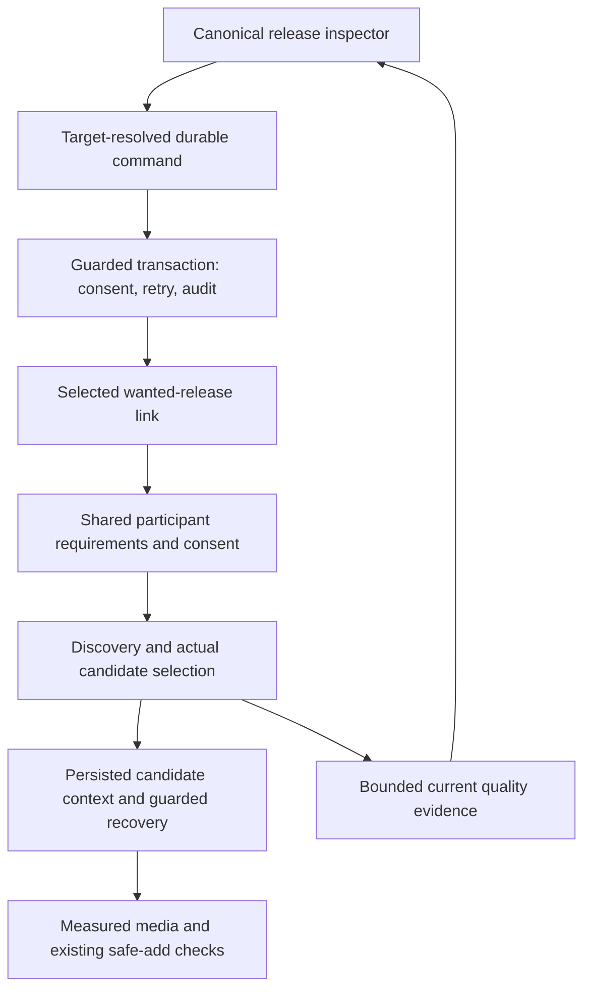

# Missing Music quality fallback outcome

Completed October 3, 2026. The separate
[design](MISSING_MUSIC_QUALITY_FALLBACK_DESIGN.md) records the original problem,
official sources, alternatives, ownership contract, and accepted approach.

## Result

Missing Music now shows bounded quality facts and an eligible **Allow fallback
quality** command in the canonical release inspector. The choice belongs to the
selected recipient's wanted release. It can broaden permitted formats while
retaining that recipient's minimum and other household recipients' requirements.
The interface distinguishes saved consent, a newly queued search, an existing
queue, and a repeated choice that queues no work. It does not claim download or
library completion.

The command reuses fresh-session, CSRF, rate-limit, server-side recipient
resolution, and durable idempotency protections. Canonical and retained legacy
entry points delegate to one guarded write. Current eligibility, maintenance,
target ownership, discovery links, and stopped quality state are checked under
the existing lock order. Consent, retry intent, and required audit commit
together. An absent link refuses the write; audit failure rolls it back;
post-commit dispatch failure leaves durable queued work for the heartbeat.

## Architecture and effective behavior

Six new backend modules separate public evidence policy, shared requirements,
guarded library writes, canonical command policy/service, and recovery policy.
The shared quality-context extraction removes approximately 175 lines from the
large discovery dispatch service. A small client presenter, component, and
action composable use the existing command gate, uncertain-retry intent,
refresh, feedback, and focus lifecycle. All first-party code remains ESM.
No migration or new schema was required.

Shared discovery broadens lossy formats only after every participant whose
requirement forbids them has valid scoped consent. Disabled and unknown
participants remain conservative; another recipient's consent is never copied.
A stored preferences object with absent quality keys retains the account's
existing Any/Any defaults. Explicit invalid values and missing policy remain
conservative. Selected-owner preferences and shared worker policy have separate
authorities.

The fallback baseline is 256 kbps. A saved High minimum retains 320 kbps,
including High combined with a FLAC preference. The strongest applicable floor
survives actual ingestion/selection, persisted candidate context, stage checks,
recovery, and measured-media checks. The generic High quality profile also
enforces its intrinsic 256 kbps baseline when no explicit floor is stored.
Any remains permissive. Search preferences do not replace the base inspection
profile or strict lossless proof requirements.

Recovery refuses older candidates carrying weaker or incompatible recipient
policy and guards the exact stored context at promotion. A real PostgreSQL
recovery scenario also exposed an existing UUID exclusion-query typing error;
the narrow correction uses UUID IDs/arrays and retains typed parameter use.
Actual codec/container evidence identifies PCM WAV and Vorbis/Ogg correctly;
renaming lossy audio to a lossless extension cannot bypass the floor or codec
check.

Worker observation timestamps prevent earlier quality findings from authorizing
new commands after a retry begins. Public facts contain only known codes,
allowlisted formats, bounded bitrate values, and boolean verification/consent
facts. Provider bodies, paths, actor metadata, and spectral internals are omitted.

## Review corrections and verification

Independent source review found and closed gaps in mixed 256/320 kbps policy,
untouched account defaults, no-op feedback, recovery context preservation,
measured codec/extension handling, and intrinsic High minimum propagation.
Tests cover the effective consumers rather than only a search ranking score.
The final reviewer reported no remaining material issue in these boundaries.

| Evidence | Result and scope |
| --- | --- |
| Complete `npm run validate` before final review corrections | 8,656 tests: server 3,663, client 4,316, scripts 513, PostgreSQL integration 164; zero failures/skips. Copyright, migration/schema, ESM, Compose, lint, hygiene, and both builds passed. |
| Final server suite after corrections | 3,677 passed, zero failures/skips. |
| Final client suite after corrections | 4,317 passed, zero failures/skips. |
| Final focused backend group | 159 passed, zero failures/skips; included in the final server suite, not an additional test total. |
| Final real PostgreSQL quality/recovery suite | Seven scenarios passed, zero skips. The earlier complete integration run included six of these; the final focused run adds actual recovery promotion/race coverage. |
| Final focused client group | 46 passed, zero skips; included in the final client suite. |
| Targeted Chromium inspector acceptance | Eight scenarios passed, zero skips; existing search/download behavior and new quality action/refresh behavior. |
| Responsive visual review | Six inspected light/dark captures at 390, 800, and 1,280 pixels; visible keyboard focus and mobile control sizing. |
| Independent policy diagnostics | 13 recovery, five intrinsic-floor, and 32 measured-media controls passed; distinct from the repository suite totals. |
| Final lint, copyright, ESM, test hygiene, and both builds | Passed after the runtime corrections. |
| Dependency-security gate | Zero npm audit vulnerabilities; Compose policy checks passed. |
| Final packaged Docker execution | Fresh install/restart, native Sharp, 104 applied migrations and zero pending, request flow, backup/restore, maintenance refusal, invalid-startup refusal, and strict cleanup passed. |
| Actual packaged ffmpeg/ffprobe controls | 12 passed: measured MP3 floors, renamed lossy refusals, PCM WAV, and Vorbis/Ogg under High and strict-profile fallback. |

The complete validation command ran while independent review was still refining
the source. The final server/client suites, focused PostgreSQL suite, browser
acceptance, policy/lint/build checks, and rebuilt package verify the subsequent
corrections. These rows are overlapping evidence, not a claimed single final
aggregate test run.

PostgreSQL scenarios use the actual worker, transaction, audit, and durable
command paths with controlled provider responses. They prove ownership and
policy behavior without live provider credentials. Browser acceptance uses
controlled API fixtures against the local application. The packaged media
controls generate real audio and use the shipped inspection service, but inject
a passing spectral invocation control; they do not prove FFT classification or
a completed physical library add. Existing strict-proof unit controls remain
part of the server suite.

Local evidence is retained under ignored `.tmp/quality-fallback-2026-10`,
`.tmp/missing-music-quality-fallback`, and `.tmp/node-runtime-2026-10`.
The final packaged runtime timestamp is `2026-10-03T16:58:44.331Z` and image ID
is `sha256:f2c6462fed5144abc742c9428127bd1011c559d832b17e3774964364719fa8e2`.
The existing smoke-evidence verifier accepted the final artifact.

| Sanitized local artifact | SHA-256 |
| --- | --- |
| `fresh-install-evidence.json` | `1adc29975d227368ad9f78200b388ddebf6678f8b3d640f8f6a6e958eb5027de` |
| `runtime-evidence.json` | `27a31a2995ca117082ff88d0ad585f218939193feb68e4a43e638fbdc6ff7c18` |
| `media-evidence.json` | `5e74e470aed2f24a2e38b0a0912a0752b68bf8701347bbc1b72dac70b5217fd4` |

## Recommendations, tradeoffs, and stack

| Recommendation | Pros | Cons or remaining cost |
| --- | --- | --- |
| Keep target-owned consent and conservative shared requirements | Protects ownership and stronger household minimums while reusing one physical acquisition pipeline | A saved choice may wait for another recipient and a fresh stopped search cycle |
| Keep transactions, durable commands, and bounded projections | Auditable rollback/replay and truthful UI state | Requires explicit lock/state and consumer tests for each new action |
| Keep small ESM policy/service/store modules and focused Vue composables | Reviewable responsibilities; easier dependency injection and consumer tracing | More boundaries must be wired and documented |
| Maintain Node 24.21 LTS with npm 12.0.2 | Compatible runtime patch and refreshed bundled Undici | Native/package rebuilds remain necessary; Node 26 compatibility is separate |
| Use the scoped-overrides skill alongside canonical-actions | Carries consent, defaults, numeric floors, and verification invariants into later work | Its consumer map must track actual implementation changes |

Recommended stack: Node 24.21 LTS and npm 12.0.2; ESM JavaScript; existing
Express routes with fresh-session/CSRF and durable commands; PostgreSQL 18 with
guarded transactions and required audit; Vue components/composables with bounded
read models; existing ffmpeg/ffprobe, lossless proof, filesystem and safe-add
gates; focused unit tests, real PostgreSQL scenarios, isolated Playwright
acceptance, and restricted Docker package smoke tests. Official-source support
and rejected alternatives are in the separate design.

The random [PR #40 replay](RANDOM_PR_40_LOCAL_REPLAY_OUTCOME.md),
[compatible runtime patch](NODE_RUNTIME_PATCH_2026_10_OUTCOME.md), and new
[scoped-overrides skill](SCOPED_POLICY_OVERRIDES_SKILL_OUTCOME.md) each have
separate design/outcome documents. The exact PR image ran locally without a
merge; the maintained runtime uses the reviewed LTS successor.

## Next item and limits

Implement canonical **Find matches** for an initial eligible Missing Music
release. The worklist already maps `search_now` to that label, while the inspector
only completes Search again for stopped retry states. Add narrowly defined
initial-search eligibility, owned durable command handling, queued-work
coalescing, and inspector refresh. Preserve active work and prove authorization,
concurrent commands, PostgreSQL rollback/replay, and visible browser behavior.
Use the existing command and queue infrastructure rather than creating another
pipeline.

This slice does not add arbitrary quality editing, independent per-recipient
downloads, automatic upgrade work, or a verification bypass. Local validation
does not establish live-provider, arm64, full image/SBOM scan, registry provenance,
or published-image acceptance. Work remains on main. No PR merge, release,
tag, hosted workflow dispatch, or image publication occurred.
