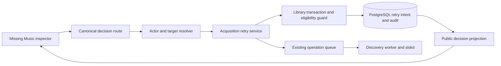

# Missing Music Search Again design

Status: Accepted for implementation
Research date: October 3, 2026

## Problem and scope

Missing Music is the canonical release-decision workspace. Its worklist and
inspector describe retry actions but cannot execute them. The inspector also
retains its initial snapshot while workers advance the release, and the page
Refresh button refreshes summaries without refreshing the selected detail.

This slice adds Search again for stopped releases and makes the inspector
refresh reliably. It covers existing `failed`, `no_matches_left`, and
`quality_choice_needed` rediscovery eligibility. Initial Find matches, quality
fallback choices, folder repair, and library-add recovery remain subsequent
slices. Search preparation can resume existing automation; it is not a promise
of an immediate download or successful acquisition.

## Official source research

URLs were discovered through web search and opened through the web tool.
Repository and PR URLs were discovered through GitHub MCP repository metadata,
the returned pull-request collection, and immutable PR metadata. This records
guidance consulted on October 3, rather than claiming an October publication
date for each source.

| Source | Application |
| --- | --- |
| [OWASP Authorization Cheat Sheet](https://cheatsheetseries.owasp.org/cheatsheets/Authorization_Cheat_Sheet.html) | Resolve the selected object and its owner on the server; authorize each command and deny unsupported scope. |
| [OWASP CSRF Prevention](https://cheatsheetseries.owasp.org/cheatsheets/Cross-Site_Request_Forgery_Prevention_Cheat_Sheet.html) | Cookie-authenticated mutations use the existing session-bound CSRF contract; required protection remains the release deployment baseline. |
| [Vue composables](https://vuejs.org/guide/reusability/composables) | Keep stateful request lifecycle in composables and clean up side effects with the owning component. |
| [Vue watchers](https://vuejs.org/guide/essentials/watchers) | Cancel or invalidate obsolete asynchronous reads when the selected decision changes. |
| [PostgreSQL 18 SELECT](https://www.postgresql.org/docs/18/sql-select.html) | Use existing transactions and row-lock boundaries when checking target eligibility and updating durable work. |
| [W3C status messages](https://www.w3.org/WAI/WCAG21/Techniques/aria/ARIA22) | Announce user-command results through a polite status region; background reads do not move keyboard focus. |
| [Playwright best practices](https://playwright.dev/docs/best-practices) | Test the visible user journey with role locators and retrying assertions. |
| [Node 24 ECMAScript modules](https://nodejs.org/download/release/latest-v24.x/docs/api/esm.html) | Keep first-party implementation and test helpers in explicit ESM modules. |

## Alternatives and recommendations

| Approach | Pros | Cons | Decision |
| --- | --- | --- | --- |
| Wire the old session-scoped acquisition URL directly into Missing Music | Small client change | Administrator actions can address the actor's scope instead of the selected recipient; bypasses the canonical command boundary | Reject |
| Add a narrow decision command delegating to existing rediscovery | Retains retry/coalescing and worker infrastructure; separates actor from target | Requires command policy, dependency wiring, and target-safe persistence checks | Adopt |
| Rebuild discovery or introduce another job queue | Independent implementation | Duplicates lifecycle rules and recovery ownership | Reject |
| Reload the inspector by remounting it | Simple | Loses context and focus and causes repeated loading transitions | Reject |
| Extend its route-owned composable with bounded background revalidation | Preserves the snapshot, focus, and existing architecture | Needs explicit overlap, stale-response, and teardown tests | Adopt |

## Backend contract

The command extends the existing modular monolith:

- `POST /api/v1/missing-music/decisions/:decisionId/search-again` accepts the
  decision ID only. The browser does not supply a trusted recipient ID.
- Fresh authenticated sessions and the existing CSRF policy match the old
  own-account rediscovery contract. Administrators can address household
  decisions; other roles remain limited to their own decisions. Download start
  retains its separate administrator requirement.
- The canonical target resolver identifies the release and target. Disabled
  target history is read-only. Current eligibility is rechecked before writes.
- Reuse the existing acquisition rediscovery service, shared discovery request,
  operation queue, and worker. Where necessary, add a narrow guarded persistence
  adapter using the existing transaction and maintenance-lock mechanisms.
- The selected user's wanted link records the retry intent. Discovery itself
  is shared by canonical release identity; this does not promise an independent
  network search per household user.
- Direct wanted-ID lookup must work beyond retained acquisition list limits.
- The route uses durable idempotency scope
  `missing-music.decisions.search-again`; the request fingerprint contains the
  decision ID. Existing queued restarts coalesce. Active operations and
  maintenance locks must not be bypassed.
- The response is a small public action projection: `code`, `decisionId`,
  `targetUserId`, `searchPreparationStarted`, `restartAlreadyQueued`,
  `dispatchAlreadyActive`, and `discoveryRunId`. Internal release evidence,
  source paths, provider payloads, and raw failures stay outside this response.
- Detail permissions expose `canSearchAgain` from the same eligibility policy.
  Required audit/Activity semantics follow the existing lifecycle service.

## Client contract

Show Search again only when the server permits it. Fixed public feedback
explains that a search was queued or already queued; unexpected transport or
database messages are not rendered. A reusable per-decision mutation lifecycle
retains a key for an uncertain retry and prevents overlapping search, selection,
and download commands. Navigation and unmount invalidate old feedback.

The inspector retains its current data during refresh, deduplicates reads,
invalidates obsolete responses, and schedules a new poll after the previous
read finishes. Revalidate on visible focus; stop hidden or disposed work and
pause background refresh during a mutation. Polling uses the established
30-second cadence. Page Refresh updates summaries, worklist, and inspector.
Successful current-decision user commands can focus the updated status heading;
background revalidation preserves focus.

## Validation and boundaries

Use focused service, route, permission, API, composable, and browser tests.
Real PostgreSQL integration must prove recipient ownership, inactive-target
and maintenance refusal, replay/coalescing, current-state conflicts, direct
lookup, and durable intent. Browser proof covers retry, refreshed status,
safe failures, page refresh, and keyboard behavior. Run `npm run validate`
before commit plus focused browser scenarios and dependency-security checks.

No schema migration is anticipated. Controlled fixtures establish application
contracts, not real provider entitlement or published-artifact acceptance.
Work stays on main, with no PR merge, tag, release, or workflow dispatch.

## Project skill and next work

Create `harmoniarr-canonical-actions` to guide future completion of visible
actions through UI, actor/target policy, durable commands, and appropriate
evidence. Version the shared copy under `.agents/skills/` and install a local
discoverable copy. Keep design and outcome records separate; the outcome must
state actual validation results and remaining limits.

Next implement the canonical quality-choice/fallback command and evidence
presentation using the same target-safe boundaries. Initial search and setup
repair follow according to the states observed in acceptance.
