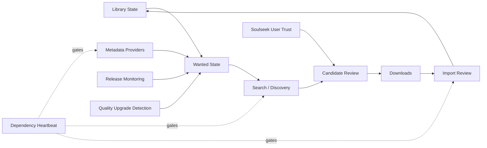
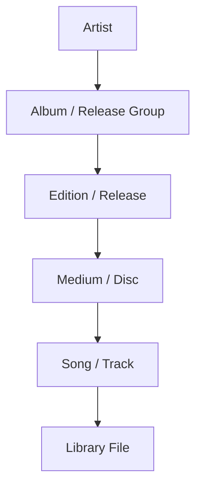
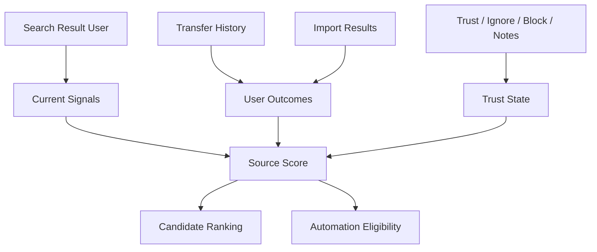
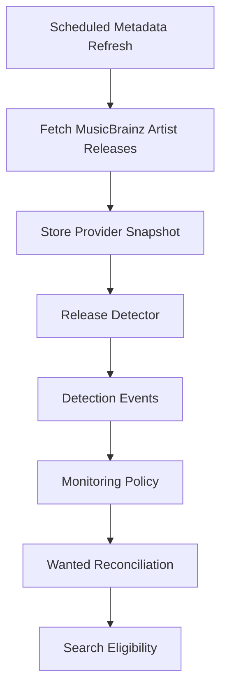
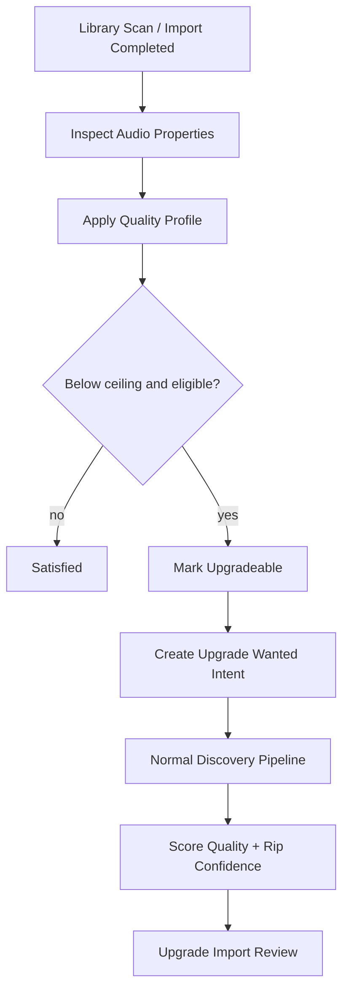
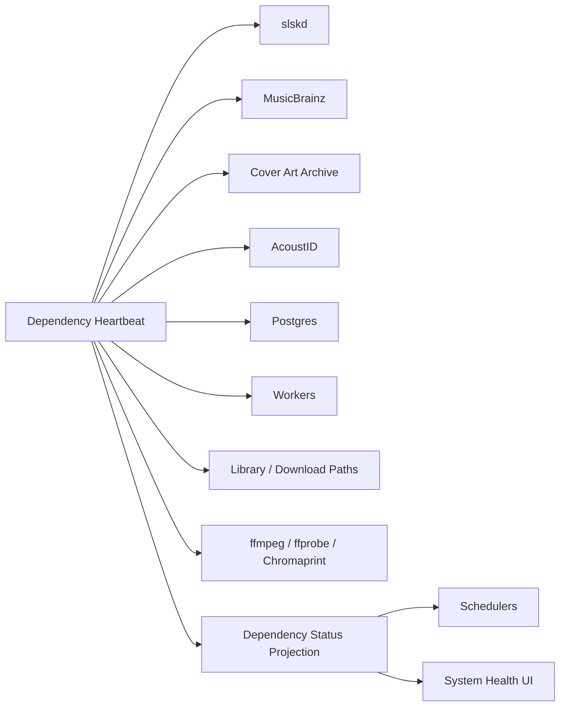
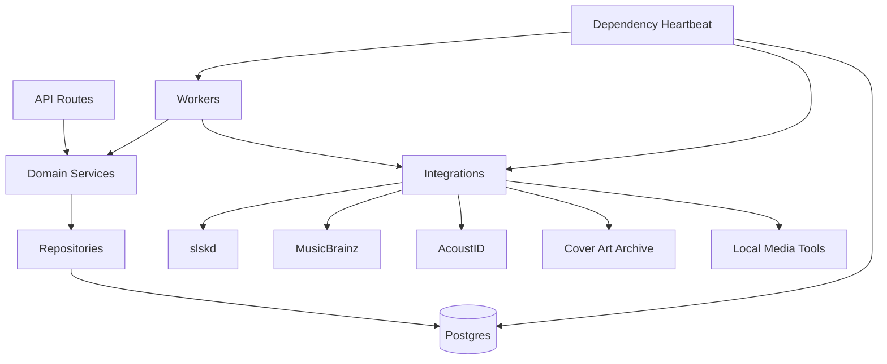

# Harmoniarr Visual Planning

## Purpose

This document is a visual companion to `docs/harmoniarr.md`.

It sketches the application shape, user workflow, service boundaries, and major screens being discussed. It is not a final UI design or implementation spec.

## Product Loop

```text
Know the library
  -> detect missing or upgradeable music
  -> search Soulseek
  -> compare candidates
  -> download selected files
  -> validate completed files
  -> import into library
  -> update library state
```



## Application Shell

```text
+--------------------------------------------------------------------------------+
| Top Bar: global search | system health | active jobs | user menu               |
+----------------------+---------------------------------------------------------+
| Sidebar              | Current View                                             |
|                      |                                                         |
| Dashboard            |  Artists, library state, priority summaries             |
| Missing              |  Missing albums, songs, partials, and upgrade gaps       |
| Activity             |  Queues, history, blocklist, source users, operations    |
| Search               |  Manual Soulseek search and large result review          |
| Settings             |  System, providers, paths, profiles, automation          |
+----------------------+---------------------------------------------------------+
```

Primary navigation intent:

```text
Dashboard = home and artist/library workspace
Missing = missing albums, songs, partials, and upgradeable gaps
Activity = operational queues, history, blocklist, and source-user management
Search = manual Soulseek search with large result sets
Settings = configuration and system health
```

The sidebar should stay focused. Dashboard is for library orientation; Activity is for operational work; Search is for raw/manual Soulseek discovery:

```text
Artists -> Dashboard table and artist detail pages
Missing -> Missing page, with summary on Dashboard
Wanted -> Activity queue, with missing acquisition surfaced on Missing
Candidates -> Activity queue, with urgent reviews surfaced on Dashboard
Downloads -> Activity queue
Imports -> Activity queue, with urgent reviews surfaced on Dashboard
Manual Search -> Search page, with compact dashboard launcher
Users -> Activity source-user view, with trusted/blocked state and notes
Blocklist -> Activity source-user view
History -> Activity history view
Albums -> Artist detail pages and global search results
```

## First Screen

The first useful screen should be operational.

```text
+--------------------------------------------------------------------------------+
| Dashboard                                                                      |
+--------------------------------------------------------------------------------+
| Setup / Health             | Wanted Summary             | Active Work          |
| - slskd connected          | - missing albums           | - searches running   |
| - MusicBrainz healthy      | - upgradeable albums       | - downloads active   |
| - paths writable           | - releases needing review  | - imports waiting    |
+----------------------------+----------------------------+----------------------+
| Search Launcher                                                                |
| search input | artist/album/track mode | open full Search page | run quick search     |
+--------------------------------------------------------------------------------+
| Artists                                                                        |
| artist | monitored | missing | partial | upgradeable | active work | action     |
+--------------------------------------------------------------------------------+
| Priority Summary                                                               |
| type | artist | album/song | reason | confidence/status | action               |
+--------------------------------------------------------------------------------+
| Urgent Candidate / Import Reviews                                              |
| artist | album | best candidate | confidence | source user | action            |
+--------------------------------------------------------------------------------+
| Recent Activity / Release Detections                                           |
| metadata refreshes, detections, user trust events, downloads, imports, failures |
+--------------------------------------------------------------------------------+
```

The dashboard is the main library page. It should show all artists by default, with filters for monitored, missing, partial, complete, upgradeable, and active-work states. It should surface urgent operational summaries, but detailed queues belong in Activity.

## Missing Page

Missing is the focused acquisition-intent page. It shows what the library is missing or what should be searched for next.

```text
+--------------------------------------------------------------------------------+
| Missing                                                                        |
+--------------------------------------------------------------------------------+
| Filters: artist | album | type | missing kind | monitored | quality | status    |
+--------------------------------------------------------------------------------+
| artist | album | song | kind | reason | monitored | last search | actions      |
| ...    | ...   | -    | album missing | monitored album absent | on | never     |
| ...    | ...   | ...  | song missing  | partial album gap      | on | 2d ago    |
| ...    | ...   | ...  | upgrade       | below quality ceiling  | on | 5d ago    |
+--------------------------------------------------------------------------------+
| Actions                                                                        |
| Search | Manual | Ignore | Unmonitor | Mark Satisfied | View Artist/Album       |
+--------------------------------------------------------------------------------+
```

Missing item kinds:

```text
missing album
missing song
partial album
future release hold
quality upgrade
failed search retry
manual wanted item
```

Action behavior:

```text
Search = create or retry managed discovery for that item
Manual = open Search page with artist, album, and song context prefilled
Ignore = stop showing this gap without deleting metadata
Unmonitor = remove from active wanted/reconciliation state
Mark Satisfied = user confirms the library already satisfies the item
View Artist/Album = open entity detail
```

Manual search handoff:

```text
Missing item selected
  -> click Manual
  -> open Search
  -> prefill artist, album, song, release year, and quality target
  -> keep correlation target attached
  -> selected search results can be correlated back to the missing item
```

## Dashboard Module Model

```text
+--------------------------------------------------------------------------------+
| Dashboard Modules                                                              |
+--------------------------------------------------------------------------------+
| Artists          | all artists, status counts, active work, add artist         |
| Priority Summary | missing, upgradeable, failed, and review-required counts    |
| Review Summary   | most urgent candidate/import reviews                        |
| Search Launcher  | compact entry into the full Search page                     |
| Recent Activity  | latest detections, imports, downloads, trust events         |
+--------------------------------------------------------------------------------+
```

Module behavior:

```text
collapsed = count and worst/most urgent state
expanded = dense table or split list/detail view
focused = larger dashboard panel, not a separate top-level page
entity detail = drawer or artist/album page when more space is needed
```

## Activity Page

Activity is the operational workbench. It is separate from the dashboard so queues, history, blocklist, and source-user decisions have enough room without crowding the artist library.

```text
+--------------------------------------------------------------------------------+
| Activity                                                                       |
+--------------------------------------------------------------------------------+
| Tabs: Queue | Wanted | Candidates | Downloads | Imports | Releases | Users     |
|       History | Blocklist | Failed | Quarantine later                            |
+--------------------------------------------------------------------------------+
| Filters | saved views | bulk actions | status summary                             |
+--------------------------------------------------------------------------------+
| Dense table or split list/detail view                                          |
+--------------------------------------------------------------------------------+
```

Activity sections:

```text
Queue = everything currently queued or actively working
Wanted = missing, monitored, failed, future, and upgradeable items
Candidates = ranked reviews waiting for action
Downloads = active, queued, stalled, failed, and completed transfers
Imports = completed downloads waiting for validation or action
Releases = detected/future releases needing policy decisions
Users = source-user trust, notes, reliability, ignored state
History = searches, detections, downloads, imports, overrides, decisions
Blocklist = blocked source users and exclusion reasons
Failed = failed searches, downloads, imports, scans, metadata jobs
Quarantine = future antivirus quarantine view
```

## Search Page

Manual search is effectively a direct query path into Soulseek through `slskd`, so it needs room for many results.

```text
+--------------------------------------------------------------------------------+
| Search                                                                         |
+--------------------------------------------------------------------------------+
| Query | mode: artist/album/track/folder | filters | run | save/create wanted   |
+--------------------------------------------------------------------------------+
| Search Strategy / Attempts                                                     |
| query text | status | result count | duration | errors                         |
+--------------------------------------------------------------------------------+
| Results                                                                        |
| select | user | folder | filename | size | bitrate/format | queue | speed | action |
+--------------------------------------------------------------------------------+
| Grouped Candidates                                                             |
| user | folder | files | quality | likely match | browse | create candidate     |
+--------------------------------------------------------------------------------+
| Bulk Actions                                                                   |
| correlate selected | create candidate | download selected | ignore | block user |
+--------------------------------------------------------------------------------+
| Result Detail / Folder Preview                                                 |
| file list, user info, trust history, download/create-wanted actions            |
+--------------------------------------------------------------------------------+
| Correlate / Override                                                           |
| link selected result to artist | album | song | replace current match | reason  |
+--------------------------------------------------------------------------------+
```

Search page behavior:

```text
raw results can be inspected without creating wanted state
selected results can become managed wanted items or candidate records
folder browsing can happen from a selected result
filters should handle large result sets
results can be sorted by user, folder, filename, size, format, bitrate, queue, speed, and match confidence
results can be filtered by text, user, folder, extension, quality, bitrate, size, queue, availability, trust state, and ignored/blocked state
multi-select and shift/range-select should work across visible rows
bulk actions should apply only to the current explicit selection
search history should remain available for debugging and repeat searches
selected results can be correlated to a known artist, album, or song
manual correlation can override the current candidate, wanted, or import association
overrides must record who/when/why and preserve the previous association
```

## Search Selection And Bulk Actions

Manual Soulseek search needs table-grade selection behavior because result sets can be large.

Selection rules:

```text
click checkbox = select one row
shift-click = select visible range
ctrl/cmd-click = add or remove one row from selection
select all visible = select rows after current filters
clear selection = remove all selected rows
selection count = always visible near bulk actions
```

Range selection should operate on the current sorted and filtered result order. If filters change, the UI should preserve selected rows where possible but clearly show when selected rows are hidden by the active filter.

Bulk actions:

```text
correlate selected to artist/album/song
create candidate from selected files
download selected files
ignore selected results
ignore selected folder
block selected user
trust selected user
copy file paths or folder paths
export selected result metadata for debugging
```

Bulk actions should preview impact before applying when they affect multiple rows, users, folders, or managed items.

## Search Correlation And Override

Manual search can correct or override what Harmoniarr currently thinks.

```text
User selects Soulseek result
  -> choose known artist, album, or song
  -> choose correlation target
  -> preview affected wanted/candidate/import state
  -> enter optional reason
  -> save manual override
  -> candidate/import/wanted state updates with audit history
```

Correlation targets:

```text
artist-level: result belongs to this artist but album is uncertain
album-level: result is a candidate for this album/release
song-level: result satisfies or replaces this song/track
new intent: result should create a new wanted artist, album, or song
not this item: result should be excluded from the current target
```

Override examples:

```text
wrong album candidate -> mark as not this album
manual folder match -> force candidate association to selected album
single loose file -> associate with a missing song
better quality result -> associate as upgrade candidate
unmanaged discovery -> create wanted item from selected result
```

Override rules:

```text
do not delete the previous automated match
store manual decision as higher-priority evidence
show override badges in candidate and import review
allow clearing or replacing an override later
require review before import if the override conflicts with metadata or fingerprint evidence
```

## Library Shape



User-facing hierarchy:

```text
Artist
  -> Albums
      -> Songs
```

Detailed metadata remains available when needed:

```text
Artist
  -> Release Group
      -> Release
          -> Medium
              -> Track
                  -> Recording
```

## Artist Page

```text
+--------------------------------------------------------------------------------+
| Artist Header                                                                  |
| name | monitored toggle | metadata source | missing / complete / upgradeable    |
+--------------------------------------------------------------------------------+
| Tabs: Overview | Albums | Wanted | Candidates | Downloads | Imports | History  |
+--------------------------------------------------------------------------------+
| Albums                                                                         |
| status | album | year | type | monitored | library state | actions             |
| Missing | ...  | ...  | LP   | on        | no files      | search / settings   |
| Partial | ...  | ...  | EP   | on        | 3/5 tracks    | fill missing        |
| Complete| ...  | ...  | LP   | on        | imported      | view / upgrade      |
+--------------------------------------------------------------------------------+
| Recently Detected Releases                                                     |
| release | type | date | policy decision | wanted state | action                |
+--------------------------------------------------------------------------------+
```

## Album Page

```text
+--------------------------------------------------------------------------------+
| Album Header                                                                   |
| cover | title | artist | selected release | year | monitored | wanted state     |
+--------------------------------------------------------------------------------+
| Tabs: Tracks | Candidates | Downloads | Imports | History | Settings           |
+--------------------------------------------------------------------------------+
| Track List                                                                     |
| # | title | duration | file state | quality | wanted | import/candidate info |
+--------------------------------------------------------------------------------+
| Candidate Summary                                                              |
| best match | confidence | source user | quality | action                     |
+--------------------------------------------------------------------------------+
```

## Wanted Module

```text
+--------------------------------------------------------------------------------+
| Wanted                                                                         |
+--------------------------------------------------------------------------------+
| Filters: status | artist | album type | quality | age | saved view            |
+--------------------------------------------------------------------------------+
| status | artist | album/song | reason | priority | next eligible | actions   |
| Wanted | ...    | ...        | missing album       | normal | now    | search |
| Wanted | ...    | ...        | below quality floor | low    | later  | review |
| Hold   | ...    | ...        | future release      | normal | date   | view   |
+--------------------------------------------------------------------------------+
```

Wanted reasons:

```text
missing album
missing song
partial album
quality upgrade
future release hold
failed retry
manual one-off request
```

## Candidate Review

```text
+--------------------------------------------------------------------------------+
| Candidate Review                                                               |
+--------------------------------------------------------------------------------+
| Expected Release                    | Observed Soulseek Folder                  |
| artist / album / year / track count | user / folder / files / queue / quality   |
+-------------------------------------+------------------------------------------+
| Track Match                                                                     |
| expected track | observed file | filename score | duration | fingerprint | state |
+--------------------------------------------------------------------------------+
| Score Breakdown                                                                 |
| metadata match | track count | quality | rip confidence | user trust | queue    |
+--------------------------------------------------------------------------------+
| Actions                                                                         |
| Download Candidate | Reject | Ignore Source | Block User | Trust User | Browse   |
+--------------------------------------------------------------------------------+
```

Candidate scoring should distinguish:

```text
identity confidence: is this the right music?
quality confidence: is this technically better?
rip confidence: does evidence support a direct CD rip?
source confidence: is this Soulseek user reliable?
operational confidence: is the queue/download likely to succeed?
```

## Source User Trust

Harmoniarr should build local trust from observed Soulseek user outcomes rather than relying on a global reputation system.



Signals:

```text
current: presence, free slot, queue length, upload slots, browse success
history: successful downloads, failed downloads, stalls, average speed, wait time
quality: accepted imports, rejected imports, FLAC/log/cue history, rip confidence
manual: trusted, ignored, blocked, notes
future: antivirus quarantine events
```

Source labels:

```text
Trusted
Reliable
New
Slow
Risky
Ignored
Blocked
Known good source
Needs review
```

Candidate priority should remain:

```text
identity match
  -> completeness
  -> quality/rip confidence
  -> source reliability
  -> queue/download practicality
```

Source reliability should help rank similar candidates and determine automation eligibility, but it should not make a wrong album or wrong song acceptable.

## Import Review

```text
+--------------------------------------------------------------------------------+
| Import Review                                                                  |
+--------------------------------------------------------------------------------+
| Downloaded Files                                                               |
| file | proposed track | tags | duration | decode | fingerprint | warnings      |
+--------------------------------------------------------------------------------+
| Destination Preview                                                            |
| current path -> library path                                                   |
+--------------------------------------------------------------------------------+
| Existing Library Comparison                                                    |
| existing file | new file | quality change | action                             |
+--------------------------------------------------------------------------------+
| Actions                                                                         |
| Import Selected | Replace Existing | Keep Both | Rematch | Reject | Quarantine  |
+--------------------------------------------------------------------------------+
```

Import review is where fingerprinting matters most. Fingerprints help confirm that a file is the expected recording, but they do not prove direct CD-rip provenance.

## Release Monitoring



Detection outcomes:

```text
new album detected -> create wanted item if monitored
new single detected -> review or wanted depending on settings
future release detected -> hold until release policy allows search
tracklist changed -> update metadata and flag affected candidates/imports
release merged -> preserve redirect and reconcile canonical metadata
```

## Quality Upgrade Detection



Settings control the upgrade behavior:

```text
upgrades enabled: yes/no
upgrade floor: lowest current quality eligible for upgrade
upgrade ceiling: target quality where searching stops
scope: global, root folder, artist, album, song
automation: manual review first, later trusted auto-upgrade
```

## Dependency Heartbeat



Status examples:

```text
healthy
degraded
rate_limited
unreachable
misconfigured
disabled
```

MusicBrainz constraints:

```text
meaningful User-Agent
one request per second by default
jittered refreshes
local cache first
back off on 503
avoid polling just to check for changes
```

## Backend Service Map



Worker set:

```text
dependency-heartbeat
metadata-refresher
release-detector
wanted-reconciler
quality-upgrade-detector
search-dispatcher
candidate-builder
folder-browser
transfer-reconciler
import-validator
```

## Settings Map

```text
Settings
  -> System Health
      -> dependencies
      -> workers
      -> database
      -> paths
  -> slskd
      -> URL
      -> authentication
      -> path mapping
  -> Metadata
      -> MusicBrainz
      -> Cover Art Archive
      -> AcoustID
      -> rate limits
      -> cache policy
  -> Monitoring
      -> albums
      -> EPs
      -> singles
      -> future releases
      -> review rules
  -> Quality Profiles
      -> allowed formats
      -> upgrade floor
      -> upgrade ceiling
      -> rip confidence policy
      -> automation policy
  -> Media Management
      -> root folders
      -> naming templates
      -> import behavior
      -> extras
      -> permissions
  -> Transcoding
      -> profiles
      -> output behavior
      -> job limits
      -> validation
  -> Automation
      -> search cadence
      -> auto-grab rules
      -> retry behavior
```

## Screen Priority

```text
1. Dashboard with all artists
2. Artist page
3. Album page
4. Missing page
5. Activity queue view
6. Activity wanted view
7. Activity candidate review view
8. Dedicated Downloader page
9. Activity import review view
10. Activity users, blocklist, and history views
11. Search page
12. System health settings
13. slskd and path settings
14. Quality profile settings
15. Monitoring settings
16. Media management settings
```
